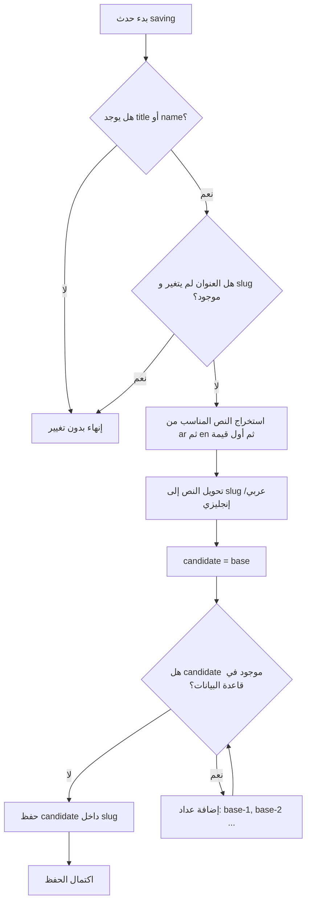

# خوارزمية توليد Slug فريد

## الهدف

توليد رابط نصي فريد لكل عنصر يعتمد على العنوان أو الاسم، مع دعم الأحرف العربية والإنجليزية والأرقام. تستخدم هذه الخوارزمية في الخدمات، المشاريع، الأخبار، الصفحات، المناقصات، الوظائف، والعملاء.

## مكان الكود

- `app/Models/Concerns/HasUniqueSlug.php`
- `app/Models/Client.php`

## الشرح

عند حفظ أي Model يستخدم `HasUniqueSlug` يعمل حدث `saving`. إذا لم يوجد عنوان فلا يحدث شيء. إذا كان العنوان لم يتغير ويوجد `slug` سابق، لا يتم توليده مرة أخرى.

بعد ذلك تستخرج الخوارزمية العنوان المناسب. إذا كان العنوان مصفوفة ترجمة أو JSON، تفضل القيمة العربية `ar` ثم الإنجليزية `en` ثم أول قيمة غير فارغة. بعدها تحول النص إلى `slug` بإبقاء الحروف العربية والإنجليزية والأرقام، وتحويل الفواصل والمسافات إلى `-`.

ثم تختبر قاعدة البيانات: هل يوجد سجل آخر بنفس `slug`؟ إذا نعم تضيف عدادا مثل `slug-1`, `slug-2` حتى تجد قيمة غير مستخدمة. في حالة التحديث تتجاهل السجل الحالي باستخدام `whereKeyNot`.

## مقتطف الكود

```php
protected static function generateUniqueSlug(string $title, $ignoreId = null): string
{
    $base = static::slugify($title);
    $candidate = $base;
    $counter = 1;

    while (
        static::query()
            ->where('slug', $candidate)
            ->when($ignoreId, fn ($q) => $q->whereKeyNot($ignoreId))
            ->exists()
    ) {
        $candidate = $base.'-'.$counter++;
    }

    return $candidate;
}
```

## Flowchart



## التعقيد

عدد الاستعلامات يعتمد على عدد التعارضات الموجودة لنفس العنوان. في الحالة العادية استعلام واحد فقط، وفي حالة وجود تعارضات كثيرة يكون العدد تقريبا `n + 1`.

## ملاحظات

- تدعم الخوارزمية العربية لأن `preg_replace` يسمح بنطاق Unicode العربي.
- في حالة العنوان الفارغ تستخدم قيمة احتياطية مثل `item` أو `client`.
- هذه الخوارزمية مهمة لأنها تمنع كسر روابط التفاصيل مثل `/projects/{slug}` و `/services/{slug}`.
