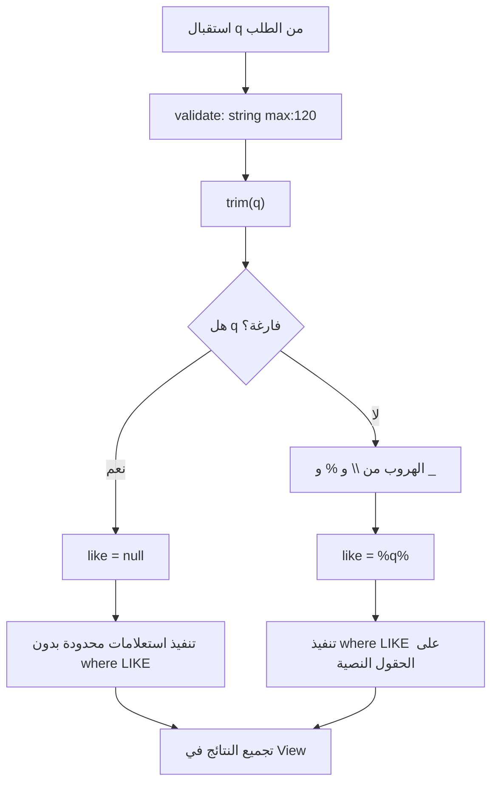

# خوارزمية البحث في المحتوى

## الهدف

تنفيذ بحث نصي موحد في محتوى الموقع العام ولوحة التحكم، مع حماية محارف `LIKE` الخاصة مثل `%` و `_`.

## مكان الكود

- `app/Http/Controllers/SiteController.php`
- `app/Http/Controllers/Admin/SearchController.php`

## الشرح

تبدأ الخوارزمية بالتحقق من قيمة `q` ثم تقليم المسافات. إذا كانت قيمة البحث فارغة تعيد `toLikePattern` القيمة `null`، وبالتالي لا يطبق شرط البحث وتظهر نتائج محدودة من كل قسم.

إذا كانت هناك عبارة بحث، يتم الهروب من المحارف الخاصة:

- `\`
- `%`
- `_`

ثم يتم بناء النمط `%query%` واستخدامه داخل استعلامات متعددة. في الموقع العام يتم البحث فقط في المحتوى المنشور عبر `published()`. في لوحة التحكم يتم البحث في كل السجلات لأن الإدارة تحتاج الوصول لكل المحتوى.

## مقتطف الكود

```php
private function toLikePattern(string $q): ?string
{
    if ($q === '') {
        return null;
    }

    $escaped = str_replace(['\\', '%', '_'], ['\\\\', '\\%', '\\_'], $q);

    return "%{$escaped}%";
}
```

```php
$services = Service::query()
    ->published()
    ->when($like !== null, fn ($query) => $query->where(function ($sub) use ($like) {
        $sub->where('title', 'like', $like)->orWhere('description', 'like', $like);
    }))
    ->limit(8)
    ->get();
```

## Flowchart



## الفرق بين بحث الموقع والإدارة

بحث الموقع:

- يبحث في الخدمات، المشاريع، الأخبار، الوظائف، المناقصات، والصفحات.
- يطبق `published()` حتى لا يظهر محتوى غير منشور للزوار.
- يحدد النتائج غالبا بـ `limit(8)`.

بحث الإدارة:

- يبحث في المشاريع، الخدمات، الأخبار، الصفحات، المناقصات، الوظائف، والرسائل.
- لا يطبق شرط النشر.
- يحدد النتائج غالبا بـ `limit(6)`.

## ملاحظات

- البحث الحالي يعتمد على `LIKE` وليس full-text search.
- إذا كبرت قاعدة البيانات يمكن تحسين الخوارزمية لاحقا بإضافة فهارس Full Text أو محرك بحث خارجي.
