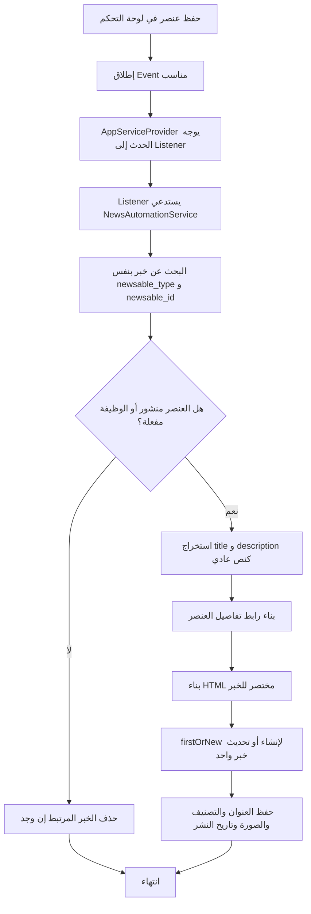

# خوارزمية مزامنة الأخبار التلقائية

## الهدف

إنشاء أو تحديث خبر تلقائي في جدول `news` عند حفظ خدمة أو مشروع أو مناقصة أو وظيفة، وحذف الخبر المرتبط عند إلغاء النشر أو تعطيل الوظيفة.

## مكان الكود

- `app/Services/NewsAutomationService.php`
- `app/Providers/AppServiceProvider.php`
- `app/Listeners/SyncAutoNewsFromProject.php`
- `app/Listeners/SyncAutoNewsFromService.php`
- `app/Listeners/SyncAutoNewsFromTender.php`
- `app/Listeners/SyncAutoNewsFromJob.php`
- Controllers الإدارة التي تطلق events بعد الحفظ.

## الشرح

عند إنشاء أو تحديث كيان من لوحة التحكم، يطلق المتحكم حدثا مثل `ProjectSavedForNews`. في `AppServiceProvider` يتم ربط الحدث بمستمع. المستمع يستدعي `NewsAutomationService`.

داخل الخدمة يتم بناء استعلام يعتمد على العلاقة متعددة الأشكال:

- `newsable_type`
- `newsable_id`

إذا كان العنصر غير منشور، يتم حذف الخبر المرتبط. إذا كان منشورا، تستخدم الخوارزمية `firstOrNew` حتى لا تنشئ أكثر من خبر لنفس الكيان، ثم تملأ العنوان والمحتوى والتصنيف والرابط والصورة.

## مقتطف الكود

```php
$news = News::query()->firstOrNew([
    'newsable_type' => $project->getMorphClass(),
    'newsable_id' => $project->id,
]);

$news->title = ['ar' => $title ?: 'مشروع جديد'];
$news->content = ['ar' => $content];
$news->category = ['ar' => 'مشاريع'];
$news->image = $project->image;
$news->is_published = true;
$news->published_at = $news->published_at ?? now();
$news->save();
```

## Flowchart



## الحالات المدعومة

| المصدر | شرط الظهور | التصنيف | الرابط |
|---|---|---|---|
| خدمة | `is_published = true` | خدمات | تفاصيل الخدمة |
| مشروع | `is_published = true` | مشاريع | تفاصيل المشروع |
| مناقصة | `is_published = true` | مناقصات | صفحة المناقصات مع anchor |
| وظيفة | `is_active = true` | وظائف | صفحة الوظائف مع anchor |

## ملاحظات

- استخدام `firstOrNew` يجعل العملية idempotent، أي يمكن تكرارها بدون إنشاء نسخ متكررة.
- عند حذف مشروع أو وظيفة أو مناقصة توجد hooks في الموديلات لحذف الأخبار المرتبطة.
- تاريخ النشر يحافظ على أول قيمة موجودة ولا يعيد تعيينها عند كل تحديث.
