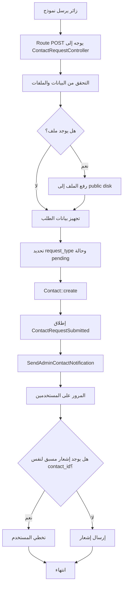

# خوارزمية استقبال طلبات الزوار

## الهدف

تحويل نماذج الزوار في الموقع إلى سجلات داخل جدول `contacts`، ثم إطلاق إشعار للمسؤولين في لوحة التحكم.

## مكان الكود

- `app/Http/Controllers/ContactRequestController.php`
- `app/Events/ContactRequestSubmitted.php`
- `app/Listeners/SendAdminContactNotification.php`
- `app/Notifications/NewContactRequestNotification.php`
- `routes/web.php`

## الشرح

يوجد أكثر من نموذج في الواجهة:

- تواصل عام.
- طلب خدمة من صفحة خدمة محددة.
- تقديم على وظيفة مع ملف سيرة ذاتية PDF.
- إرسال عرض لمناقصة مع ملف PDF اختياري.

كل دالة تبدأ بالتحقق من البيانات. بعد ذلك يتم تحويل نوع الطلب إلى قيمة عربية مناسبة مثل `طلب خدمة` أو `طلب توظيف`. إذا كان هناك ملف، يتم رفعه إلى `public` disk. بعدها يتم إنشاء سجل `Contact` بحالة `pending` ثم إطلاق الحدث `ContactRequestSubmitted`.

المستمع `SendAdminContactNotification` يمر على كل مستخدمي الإدارة ويرسل إشعارا بشرط ألا يكون نفس الإشعار موجودا مسبقا لنفس المستخدم ونفس الطلب.

## مقتطف الكود

```php
$contact = Contact::create([
    'full_name' => $validated['full_name'],
    'phone' => $validated['phone'],
    'email' => $validated['email'],
    'request_type' => Contact::TYPE_CAREER_AR,
    'service_requested' => $job->title,
    'cv_file' => $request->file('cv_file')->store('cv-files', 'public'),
    'message' => $validated['message'] ?? ('طلب توظيف على وظيفة: ' . $job->title),
    'status' => 'pending',
]);

event(new ContactRequestSubmitted($contact));
```

```php
$alreadyExists = $user->notifications()
    ->where('type', NewContactRequestNotification::class)
    ->where('data->contact_id', $event->contact->id)
    ->exists();
```

## Flowchart



## أنواع الطلبات

| النموذج | request_type | الملف |
|---|---|---|
| تواصل عام | `تواصل عام` أو حسب الاختيار | PDF اختياري |
| طلب خدمة | `طلب خدمة` | لا يوجد |
| تقديم وظيفة | `طلب توظيف` | PDF مطلوب |
| عرض مناقصة | `عرض طلب` | PDF اختياري حتى 10MB |

## ملاحظات

- كل الطلبات تدخل نفس جدول `contacts` لتوحيد المتابعة الإدارية.
- يتم استخدام `route('media.file')` لاحقا لعرض الملفات المخزنة.
- منع التكرار في المستمع يقلل تكرار الإشعارات عند إعادة إطلاق الحدث.
