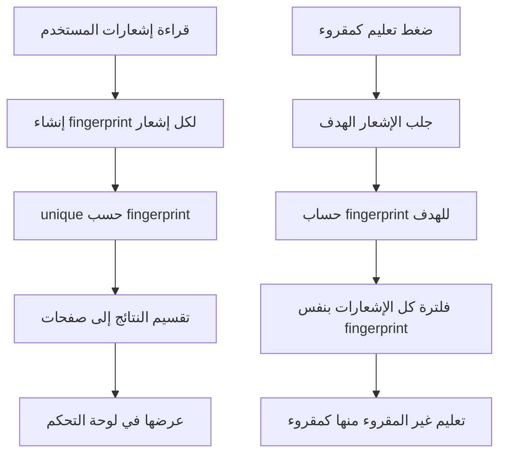

# خوارزمية إزالة تكرار الإشعارات

## الهدف

عرض إشعارات لوحة التحكم بدون نسخ مكررة لنفس الطلب، وتعليم الإشعارات المرتبطة بنفس الطلب كمقروءة معا.

## مكان الكود

- `app/Http/Controllers/Admin/NotificationController.php`
- `app/Providers/AppServiceProvider.php`

## الشرح

كل إشعار في Laravel لديه `id` فريد، لكن قد تظهر نسخ متعلقة بنفس الطلب. لذلك لا تعتمد الخوارزمية على `id` فقط، بل تبني بصمة من:

- `contact_id`
- نوع الإشعار `type`
- رابط الإشعار `url`

عند عرض الإشعارات تستخدم `unique` على هذه البصمة. عند تعليم إشعار واحد كمقروء، يتم البحث عن كل الإشعارات التي تحمل نفس البصمة وتعليمها كمقروءة.

في `AppServiceProvider` تستخدم نفس فكرة البصمة لعرض آخر خمسة إشعارات في الهيدر وحساب عدد غير المقروء بدون تكرار.

## مقتطف الكود

```php
private function notificationFingerprint($notification): string
{
    return ($notification->data['contact_id'] ?? $notification->id)
        . '|' . ($notification->type ?? '')
        . '|' . ($notification->data['url'] ?? '');
}
```

```php
private function relatedNotifications(Collection $notifications, $target): Collection
{
    $fingerprint = $this->notificationFingerprint($target);

    return $notifications->filter(
        fn ($notification) => $this->notificationFingerprint($notification) === $fingerprint
    );
}
```

## Flowchart



## مثال بصمة

```text
15|App\Notifications\NewContactRequestNotification|https://example.test/admin/contacts/15
```

هذا يعني أن أي إشعار يحمل نفس `contact_id` والنوع والرابط سيتم اعتباره نفس الإشعار من ناحية العرض.

## ملاحظة تحسين

الخوارزمية تمنع التكرار عند العرض وتتعامل مع الإشعارات المرتبطة عند تعليم إشعار واحد كمقروء. كما أن المستمع يمنع إنشاء التكرارات الحديثة. إذا وجدت بيانات قديمة فيها تكرارات كثيرة، يمكن تحسين `markAllAsRead` لاحقا ليستخدم `relatedNotifications` لكل بصمة بدلا من تعليم ممثل واحد فقط.
