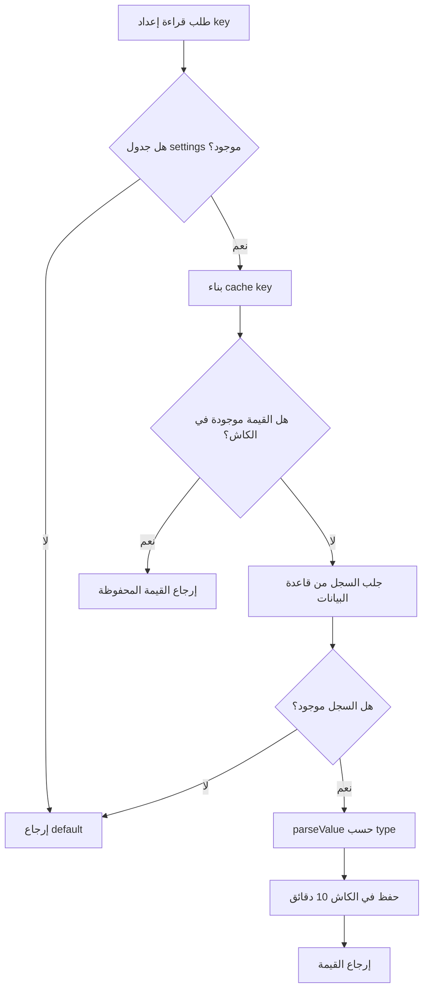
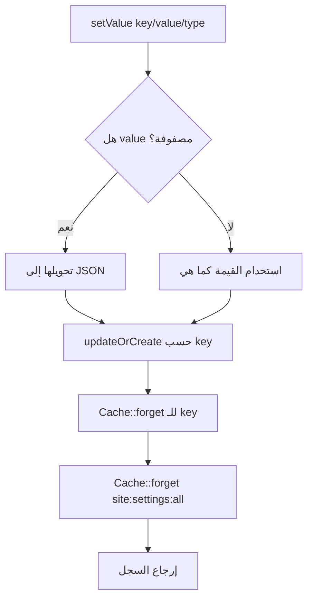

# خوارزمية قراءة الإعدادات مع الكاش

## الهدف

توفير طريقة موحدة وسريعة لقراءة وتحديث إعدادات الموقع مثل الشعار، الألوان، تفعيل صفحة العملاء، والنصوص العامة.

## مكان الكود

- `app/Models/Setting.php`
- `app/Http/Controllers/SiteController.php`
- `app/Providers/AppServiceProvider.php`

## الشرح

كل إعداد في جدول `settings` يتكون من:

- `key`
- `value`
- `type`
- `description`

عند القراءة تستخدم الخوارزمية `getValue`. أولا تتحقق من وجود الجدول حتى لا يتعطل التطبيق قبل تنفيذ migrations. ثم تبني مفتاح كاش مثل `settings:value:clients_page_enabled`. إذا كانت القيمة في الكاش تعيدها مباشرة، وإلا تجلبها من قاعدة البيانات وتستخدم `parseValue`.

عند التحديث تستخدم `setValue`. إذا كانت القيمة مصفوفة تحولها إلى JSON، ثم تستخدم `updateOrCreate`. بعدها تفرغ كاش المفتاح وكاش تجميعة إعدادات الموقع.

## مقتطف الكود

```php
public static function getValue(string $key, $default = null)
{
    if (! Schema::hasTable((new self())->getTable())) {
        return $default;
    }

    $cacheKey = "settings:value:{$key}";

    return Cache::remember($cacheKey, now()->addMinutes(10), function () use ($key, $default) {
        $setting = self::query()->where('key', $key)->first();
        if (! $setting) {
            return $default;
        }

        return $setting->parseValue();
    });
}
```

```php
public function parseValue()
{
    switch ($this->type) {
        case 'json':
            $decoded = json_decode((string) $this->value, true);
            return json_last_error() === JSON_ERROR_NONE ? $decoded : $this->value;
        case 'boolean':
            return filter_var($this->value, FILTER_VALIDATE_BOOLEAN, FILTER_NULL_ON_FAILURE) ?? false;
        case 'integer':
            return (int) $this->value;
        case 'image':
            return $this->value ? route('media.file', ['path' => ltrim((string) $this->value, '/')]) : null;
        default:
            return $this->value;
    }
}
```

## Flowchart



## Flowchart التحديث



## ملاحظات

- يتم تفريغ الكاش أيضا عند `saved` و `deleted`.
- نوع `image` يرجع رابط `/media` جاهزا للعرض.
- هذا التصميم يقلل الاستعلامات المتكررة في الواجهة والهيدر والفوتر.
