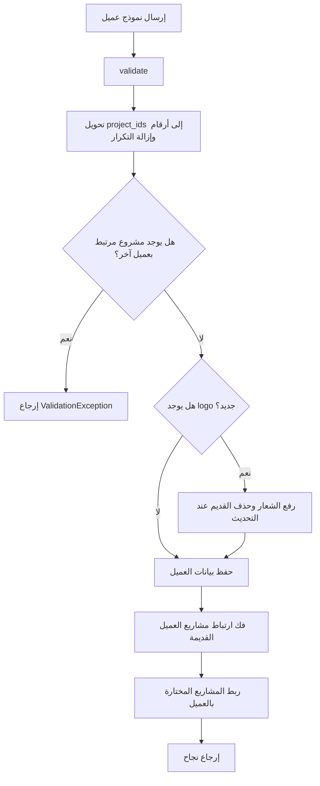

# خوارزمية ربط العملاء بالمشاريع

## الهدف

إدارة علاقة العميل بالمشاريع بحيث يمكن ربط عميل واحد بعدة مشاريع، مع منع ربط نفس المشروع بعميلين في نفس الوقت.

## مكان الكود

- `app/Http/Controllers/Admin/ClientController.php`
- `app/Models/Client.php`
- `app/Models/Project.php`

## الشرح

عند إنشاء أو تحديث عميل تستقبل الخوارزمية قائمة `project_ids`. يتم تحويل القيم إلى أرقام صحيحة، إزالة التكرار، ثم فحص التعارضات.

في الإنشاء، أي مشروع مختار وله `client_id` مسبق يعد تعارضا. في التحديث، يسمح بأن يكون المشروع مرتبطا بنفس العميل الحالي، لكنه يمنع أن يكون مرتبطا بعميل آخر.

بعد حفظ العميل، تنفذ `syncClientProjects`:

1. تفك ارتباط كل المشاريع القديمة لهذا العميل.
2. تربط المشاريع المختارة بالعميل الحالي.

عند حذف العميل، تفك الخوارزمية ارتباط المشاريع ولا تحذف المشاريع نفسها.

## مقتطف الكود

```php
$projectIds = array_values(array_unique(array_map('intval', $validated['project_ids'] ?? [])));

$conflict = Project::query()
    ->whereIn('id', $projectIds)
    ->whereNotNull('client_id')
    ->where('client_id', '!=', $client->id)
    ->exists();
```

```php
private function syncClientProjects(Client $client, array $projectIds): void
{
    Project::query()->where('client_id', $client->id)->update(['client_id' => null]);

    Project::query()
        ->whereIn('id', $projectIds)
        ->update(['client_id' => $client->id]);
}
```

## Flowchart



## تفعيل صفحة العملاء

يوجد مسار منفصل لتفعيل أو إخفاء صفحة `عملاؤنا`. يتم حفظ القيمة في الإعداد:

```php
Setting::setValue('clients_page_enabled', $request->boolean('enabled') ? '1' : '0', 'boolean');
```

ثم يستخدم الموقع هذا الإعداد لإظهار الرابط في القائمة والسماح بالدخول إلى `/clients`.

## ملاحظات

- العلاقة الفعلية موجودة في جدول `projects` عبر العمود `client_id`.
- حذف العميل لا يحذف المشاريع، فقط يجعل `client_id = null`.
- ترتيب ظهور العملاء يعتمد على `sort_order` ثم `id`.
