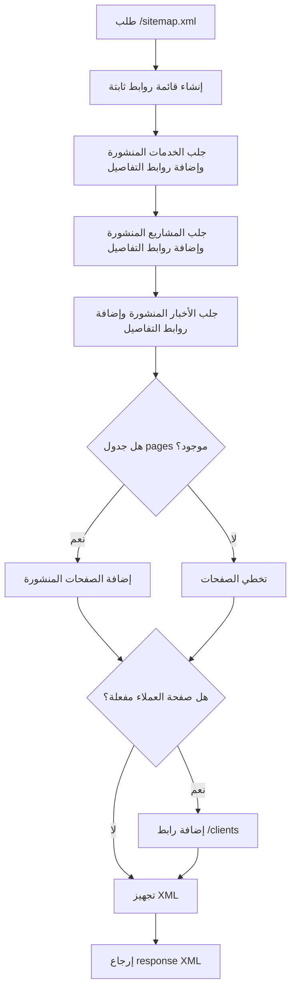
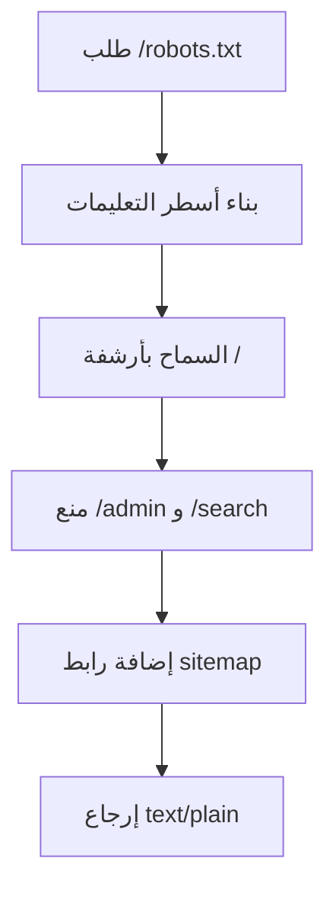

# خوارزمية توليد Sitemap و Robots

## الهدف

توليد ملف `sitemap.xml` ديناميكي يجمع روابط الموقع المنشورة، وملف `robots.txt` يوجه محركات البحث إلى الصفحات المسموحة والممنوعة.

## مكان الكود

- `app/Http/Controllers/SiteController.php`
- `routes/web.php`
- `resources/views/site/sitemap.blade.php`

## الشرح

تبدأ الخوارزمية بقائمة روابط ثابتة مهمة مثل الرئيسية، من نحن، الخدمات، المشاريع، الأخبار، التواصل، الوظائف، والمناقصات. لكل رابط يتم تحديد:

- `loc`
- `lastmod`
- `changefreq`
- `priority`

بعدها تدمج الخوارزمية روابط الخدمات المنشورة، المشاريع المنشورة، الأخبار المنشورة، والصفحات المنشورة من جدول `pages` إذا كان موجودا. وإذا كانت صفحة العملاء مفعلة وجدول العملاء موجودا، تضيف رابط `/clients`.

في النهاية ترسل response من نوع XML.

## مقتطف الكود

```php
$urls = $urls
    ->merge(Service::query()->published()->get()->map(fn ($service) => [
        'loc' => route('services.details', $service->slug),
        'lastmod' => optional($service->updated_at)->toDateString() ?? now()->toDateString(),
        'changefreq' => 'weekly',
        'priority' => '0.8',
    ]))
    ->merge(Project::query()->published()->get()->map(fn ($project) => [
        'loc' => route('projects.details', $project->slug),
        'lastmod' => optional($project->updated_at)->toDateString() ?? now()->toDateString(),
        'changefreq' => 'weekly',
        'priority' => '0.8',
    ]));
```

```php
return response()
    ->view('site.sitemap', ['urls' => $urls->values()])
    ->header('Content-Type', 'application/xml; charset=UTF-8');
```

## Flowchart



## Robots

ملف `robots.txt` يبنى من أسطر ثابتة:

```php
$lines = [
    'User-agent: *',
    'Allow: /',
    'Disallow: /admin',
    'Disallow: /search',
    'Sitemap: ' . route('sitemap'),
];
```

## Flowchart Robots



## ملاحظات

- الخوارزمية تعرض فقط المحتوى المنشور في الروابط الديناميكية.
- `lastmod` يعتمد على `updated_at` إذا توفر، وإلا يستخدم تاريخ اليوم.
- وجود `sitemap.xml` يساعد SEO على اكتشاف صفحات التفاصيل.
