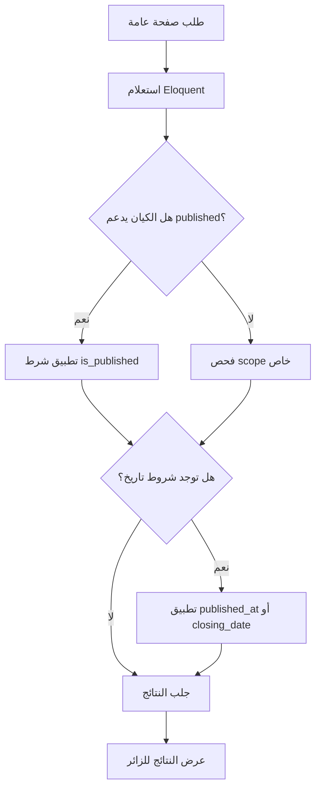
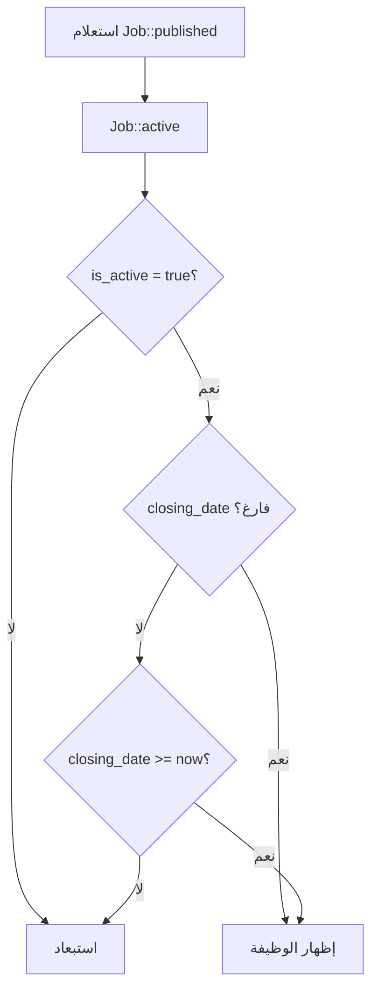
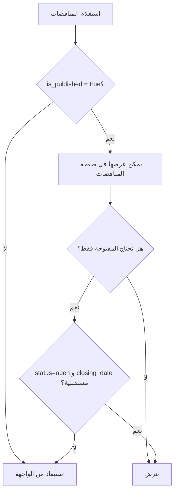

# خوارزمية فلترة النشر والحالات

## الهدف

تحديد ما يظهر للزوار في واجهة الموقع بناء على حالة النشر أو النشاط أو تاريخ الإغلاق.

## مكان الكود

- `app/Models/Service.php`
- `app/Models/Project.php`
- `app/Models/News.php`
- `app/Models/Job.php`
- `app/Models/Tender.php`
- `app/Models/Page.php`

## الشرح

تستخدم الواجهة العامة scopes مثل `published()` و `active()` لضمان عدم عرض المحتوى غير الجاهز. هذه الخوارزميات صغيرة لكنها مركزية لأن أغلب صفحات الزوار تعتمد عليها.

## القواعد

| الكيان | القاعدة |
|---|---|
| Service | `is_published = true` مع ترتيب `sort_order` |
| Project | `is_published = true` |
| News | `is_published = true` و `published_at <= now()` |
| Job | `is_active = true` و `closing_date` فارغ أو مستقبلي |
| Tender | `is_published = true` للعرض، و `status = open` مع تاريخ مستقبلي للمفتوحة |
| Page | `is_published = true` |

## مقتطفات الكود

```php
public function scopePublished($query)
{
    return $query->where('is_published', true)
                 ->where('published_at', '<=', now());
}
```

```php
public function scopeActive($query)
{
    return $query->where('is_active', true)
        ->where(function ($q) {
            $q->whereNull('closing_date')
              ->orWhere('closing_date', '>=', now());
        });
}
```

```php
public function scopeOpen($query)
{
    return $query->where('status', 'open')
                 ->where('closing_date', '>=', now());
}
```

## Flowchart عام



## Flowchart الوظائف



## Flowchart المناقصات



## ملاحظات

- الأخبار تحتاج تاريخ نشر حتى يمكن جدولة خبر للمستقبل.
- الوظائف تستخدم `is_active` وليس `is_published`.
- `Tender::isOpen()` يعطي فحصا برمجيا سريع جدا لحالة المناقصة الواحدة.
