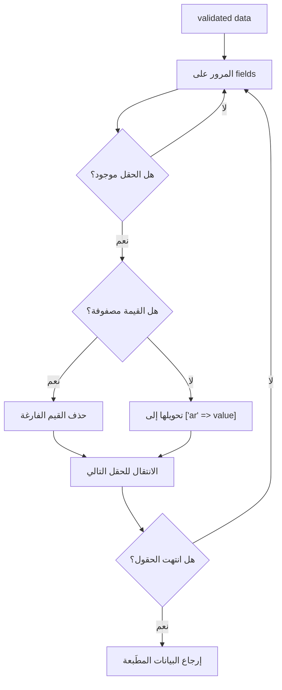
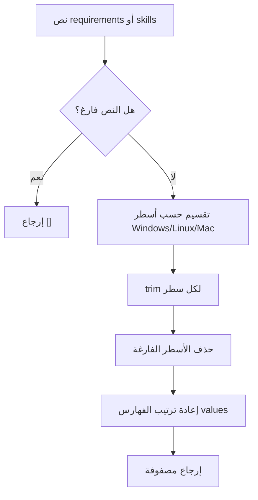

# خوارزمية تطبيع المدخلات قبل الحفظ

## الهدف

توحيد شكل البيانات القادمة من نماذج الإدارة قبل حفظها في قاعدة البيانات، خصوصا الحقول المترجمة والقوائم متعددة الأسطر.

## مكان الكود

- `app/Http/Controllers/Admin/ProjectController.php`
- `app/Http/Controllers/Admin/ServiceController.php`
- `app/Http/Controllers/Admin/NewsController.php`
- `app/Http/Controllers/Admin/PageController.php`
- `app/Http/Controllers/Admin/JobController.php`

## تطبيع الحقول المترجمة

بعض الموديلات تستخدم `Spatie\Translatable\HasTranslations`، وهذا يعني أن الحقل مثل `title` يمكن أن يخزن كمصفوفة:

```php
['ar' => 'عنوان عربي', 'en' => 'English title']
```

إذا جاء الإدخال كنص عادي، تحوله الخوارزمية إلى:

```php
['ar' => 'النص']
```

إذا جاء كمصفوفة، تحذف القيم الفارغة وتبقي القيم الموجودة.

## مقتطف الكود

```php
private function normalizeTranslatables(array $validated, array $fields): array
{
    foreach ($fields as $field) {
        if (! array_key_exists($field, $validated)) {
            continue;
        }

        if (is_array($validated[$field])) {
            $validated[$field] = array_filter($validated[$field], fn ($v) => $v !== null && $v !== '');
            continue;
        }

        $validated[$field] = ['ar' => $validated[$field]];
    }

    return $validated;
}
```

## Flowchart الحقول المترجمة



## تحويل النص متعدد الأسطر إلى مصفوفة

في الوظائف، حقول مثل `requirements` و `skills` تدخل من لوحة التحكم كنص متعدد الأسطر. الخوارزمية تحول كل سطر غير فارغ إلى عنصر في مصفوفة تحفظ كـ JSON.

## مقتطف الكود

```php
private function toArrayFromLines(?string $value): array
{
    if (!$value) {
        return [];
    }

    return collect(preg_split('/\r\n|\r|\n/', $value))
        ->map(fn ($line) => trim((string) $line))
        ->filter()
        ->values()
        ->all();
}
```

## Flowchart القوائم متعددة الأسطر



## لماذا هذه الخوارزمية مهمة؟

- تمنع اختلاف شكل البيانات بين النماذج.
- تجعل الواجهة قادرة على قراءة الحقول المترجمة بشكل موحد.
- تجعل المتطلبات والمهارات بيانات منظمة بدل نص طويل يصعب عرضه.
