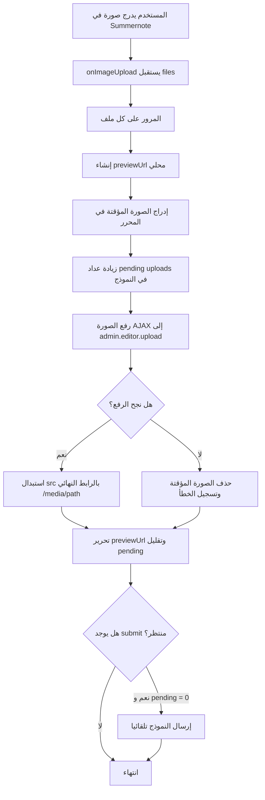

# تدفق رفع صور Summernote

## توضيح الاسم

الكود الحالي لا يحتوي على DFS بالمعنى الأكاديمي `Depth First Search`. تم الاحتفاظ باسم الملف `DFS_in_summernote.md` لأنه ظاهر في التبويب المفتوح ولأن هذا الملف يشرح تسلسل تدفق البيانات داخل Summernote. الخوارزمية الفعلية هنا هي: إدراج معاينة محلية للصورة، رفعها في الخلفية، ثم استبدال `src` المؤقت بالرابط النهائي.

## الهدف

منع حفظ صور Base64 داخل قاعدة البيانات. بدلا من ذلك يتم رفع الصورة إلى التخزين العام ثم حفظ رابطها فقط داخل محتوى المحرر.

## مكان الكود

- `resources/views/admin/partials/summernote.blade.php`
- `app/Http/Controllers/Admin/EditorUploadController.php`
- `app/Http/Requests/Admin/EditorImageUploadRequest.php`
- `routes/web.php`

## الشرح

عند إدراج صورة في Summernote يستقبل callback `onImageUpload` قائمة ملفات. لكل ملف تنفذ الخوارزمية التالي:

1. إنشاء رابط معاينة محلي باستخدام `URL.createObjectURL`.
2. إدراج الصورة المؤقتة داخل المحرر بسرعة حتى لا ينتظر المستخدم.
3. وسم الصورة بـ `data-uploading` وتخفيف شفافيتها.
4. زيادة عداد الرفع المعلق داخل النموذج.
5. رفع الصورة عبر AJAX إلى `admin.editor.upload`.
6. إذا نجح الرفع، استبدال `src` المؤقت بالرابط النهائي القادم من السيرفر.
7. إذا فشل الرفع، حذف المعاينة المؤقتة.
8. تقليل عداد الرفع المعلق.
9. إذا كان المستخدم ضغط حفظ أثناء الرفع، يتم إرسال النموذج تلقائيا بعد اكتمال كل الصور.

## مقتطف الكود

```js
onImageUpload: function (files) {
  var $editor = $(this);
  if (!files || !files.length) return;

  Array.prototype.forEach.call(files, function (file) {
    var previewUrl = makePreviewUrl(file);
    var insertedImageEl = null;

    if (previewUrl) {
      $editor.summernote('insertImage', previewUrl, function ($image) {
        insertedImageEl = $image && $image.length ? $image.get(0) : null;
      });
    }

    var $form = pendingUploadsInc($editor);

    uploadEditorImage(file, context, function (url) {
      if (insertedImageEl) {
        insertedImageEl.src = url;
      }
      pendingUploadsDec($form);
      maybeAutoSubmit($form);
    });
  });
}
```

```php
public function store(EditorImageUploadRequest $request): JsonResponse
{
    $context = $request->validated('context') ?? 'general';
    $path = $request->file('image')->store("editor/{$context}", 'public');

    return response()->json([
        'url' => route('media.file', ['path' => $path]),
        'path' => $path,
    ]);
}
```

## Flowchart



## منع الحفظ أثناء الرفع

يوجد handler على حدث `submit` لكل النماذج. إذا كان عداد الصور المرفوعة أكبر من صفر، يمنع الإرسال مؤقتا، يعطل زر الحفظ، ويضع علامة `editor-submit-waiting`.

```js
$(document).on('submit', 'form', function (e) {
  var $form = $(this);
  var pending = Number($form.data('editor-uploads-pending') || 0);
  if (pending <= 0) return;

  e.preventDefault();
  $form.data('editor-submit-waiting', true);
  $form.find(':submit').prop('disabled', true);
});
```

## ملاحظات

- هذه الخوارزمية تحسن الأداء لأن قاعدة البيانات لا تخزن Base64 طويل.
- استخدام `/media/{path}` يجعل عرض الصور يعمل حتى بدون `storage:link`.
- التدفق خطي على عدد الصور `O(n)`، وكل صورة لها طلب AJAX مستقل.
