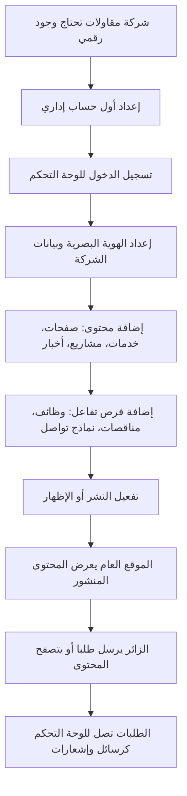

# خريطة تشغيل التطبيق

## الفكرة العامة

التطبيق مصمم ليحول شركة مقاولات من عدم وجود رقمي إلى موقع قابل للإدارة بالكامل. المسؤول لا يحتاج إلى تعديل ملفات الموقع؛ كل شيء مهم يدخل من لوحة التحكم ثم يظهر في الموقع العام إذا كان منشورا أو مفعلا.

## طبقات التشغيل

1. الزائر يرى الموقع العام: الرئيسية، من نحن، الخدمات، المشاريع، الأخبار، الوظائف، المناقصات، العملاء، التواصل.
2. المسؤول يدخل لوحة التحكم لإدارة البيانات.
3. المتحكمات تحفظ البيانات في الجداول المناسبة.
4. النماذج تضيف منطق مثل `slug`، النشر، العلاقات، وروابط الصور.
5. الموقع العام يقرأ فقط البيانات المسموح عرضها.

## Flowchart عام



## أهم العلاقات

| العملية | مصدر الإدارة | نتيجة الموقع |
|---|---|---|
| الهوية البصرية | Settings | الشعار، الألوان، الهيدر، الفوتر، بيانات التواصل |
| من نحن | Settings | صفحة تعريفية قابلة للتخصيص |
| الصفحات | Pages | روابط صفحات ثابتة |
| الخدمات | Services | صفحة خدمات وتفاصيل كل خدمة |
| المشاريع | Projects | صفحة أعمال وتفاصيل وربط بالخدمات والعملاء |
| الأخبار | News + NewsAutomationService | أخبار يدوية وتلقائية |
| المناقصات | Tenders | قائمة مناقصات ونموذج إرسال عرض |
| الوظائف | Jobs | قائمة وظائف ونموذج تقديم |
| العملاء | Clients + Projects | صفحة عملاؤنا وشعارات في الرئيسية |
| الرسائل | Contacts | صندوق متابعة للطلبات الواردة |

## المبدأ الأمني

كل مسارات الإدارة داخل:

```php
Route::middleware('auth')->group(function () {
    // admin resources
});
```

أما إدارة المستخدمين تحديدا فتحتاج صلاحية:

```php
->middleware('can:manage-users')
```

وهذه الصلاحية معرفة في `AppServiceProvider` وتعتمد على `is_super_admin`.
