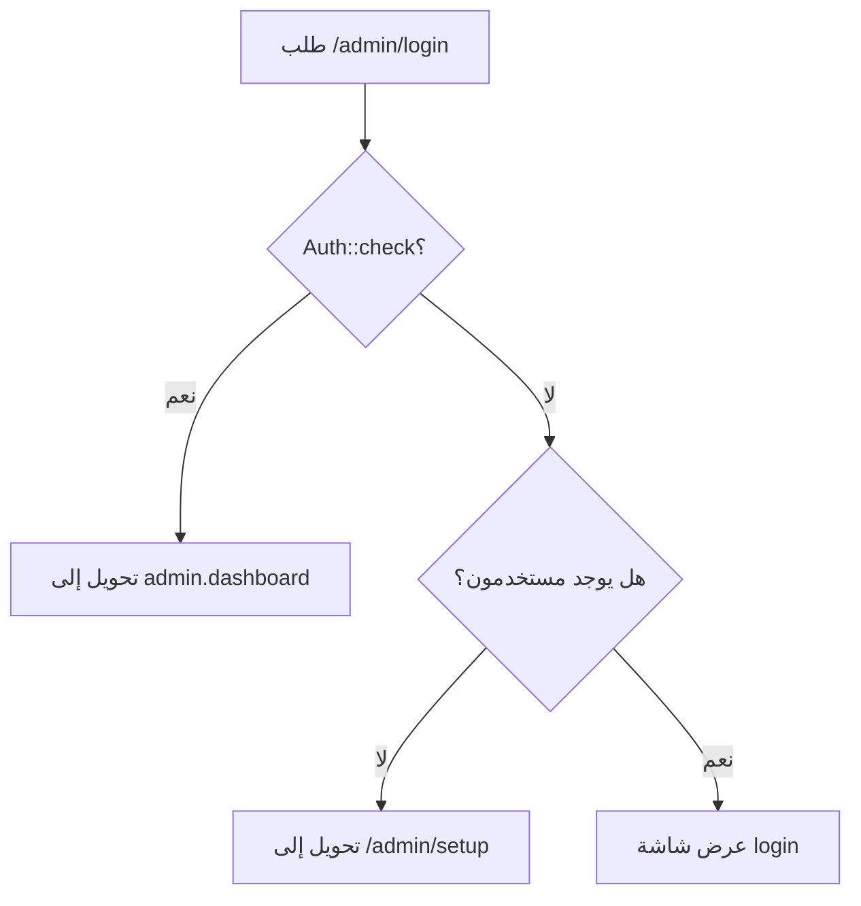
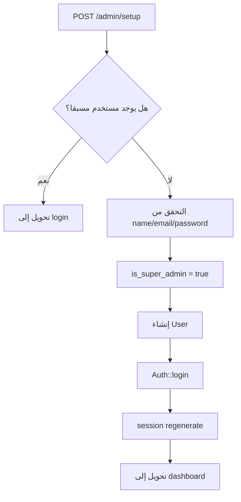
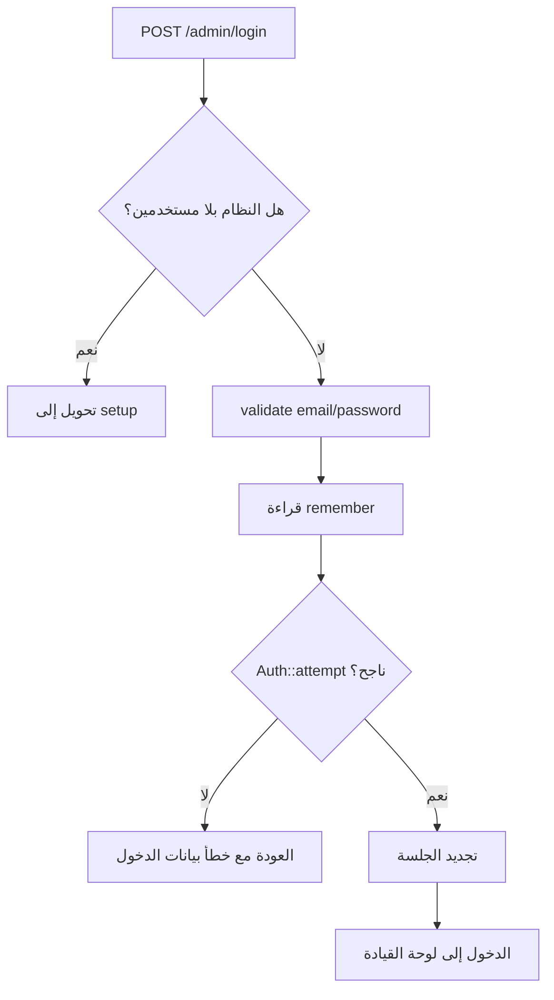
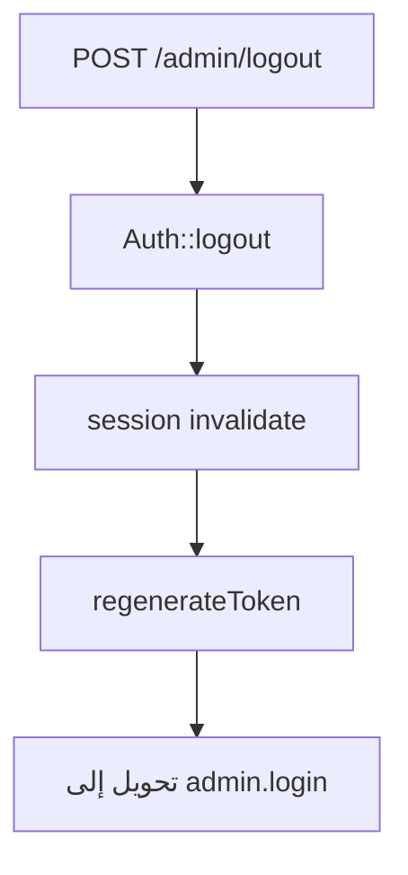

# خوارزمية تسجيل الدخول للوحة التحكم

## الهدف

ضمان أن لوحة التحكم لا تستخدم إلا من مسؤول مصرح له، مع دعم إعداد أول حساب إداري عند تشغيل المشروع لأول مرة.

## الملفات المرتبطة

- `app/Http/Controllers/Admin/AuthController.php`
- `routes/web.php`
- `app/Models/User.php`

## الحالات الأساسية

1. إذا كان المسؤول مسجل الدخول بالفعل، يوجه إلى لوحة القيادة.
2. إذا لم يوجد أي مستخدم في جدول `users`، يوجه إلى شاشة الإعداد الأولي.
3. إذا وجد مستخدمون، تظهر شاشة تسجيل الدخول.

## خوارزمية عرض شاشة الدخول

## خوارزمية إعداد أول مشرف

## خوارزمية تسجيل الدخول

## خوارزمية الخروج

## نتيجة العملية

بعد نجاح الدخول يستطيع المستخدم الوصول إلى مسارات الإدارة المحمية، ومن خلالها إدارة الهوية الرقمية والمحتوى والطلبات.
