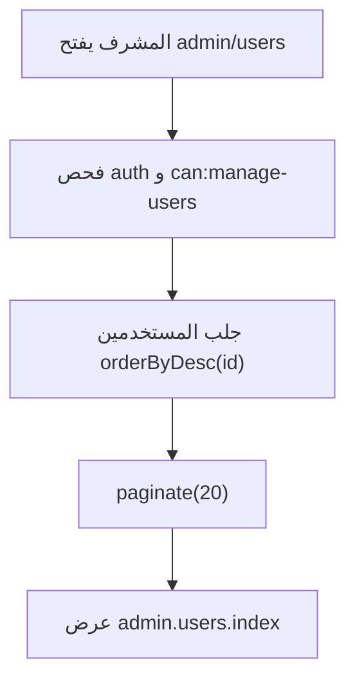
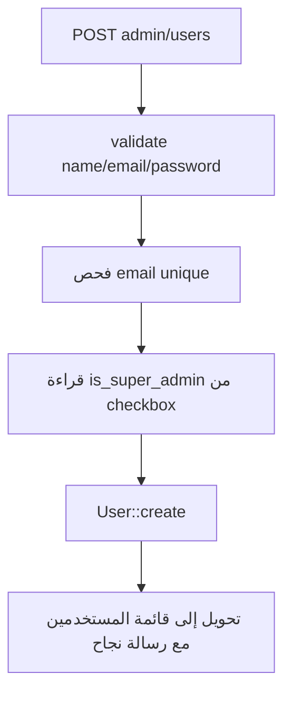
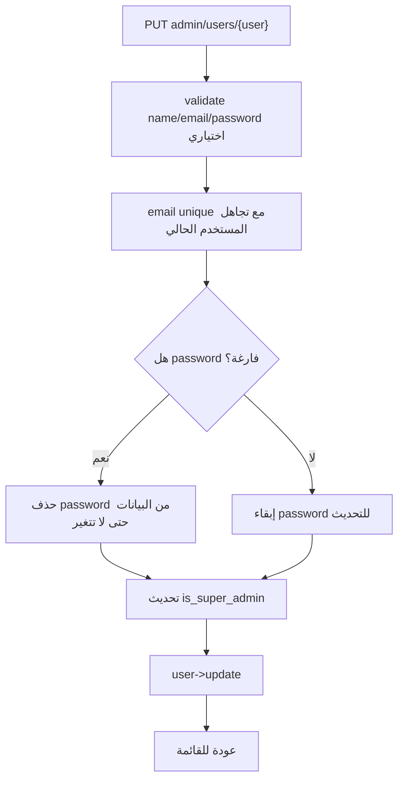
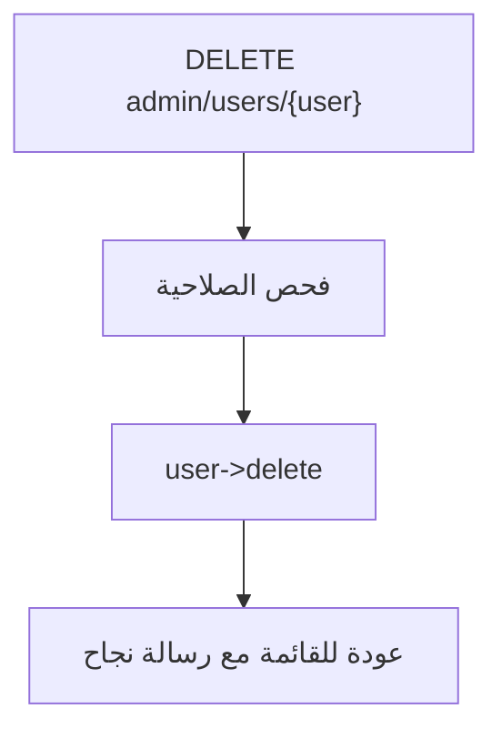

# خوارزمية إدارة المستخدمين

## الهدف

تمكين المشرف الأعلى من إنشاء وتحديث وحذف مستخدمي لوحة التحكم، وتحديد من يمتلك صلاحية إدارة المستخدمين عبر `is_super_admin`.

## الملفات المرتبطة

- `app/Http/Controllers/Admin/UserController.php`
- `app/Providers/AppServiceProvider.php`
- `routes/web.php`
- `app/Models/User.php`

## شرط الوصول

مسارات المستخدمين محمية بـ:

```php
Route::resource('users', AdminUserController::class)
    ->except(['show'])
    ->middleware('can:manage-users');
```

والصلاحية معرفة هكذا:

```php
Gate::define('manage-users', function (User $user): bool {
    return (bool) $user->is_super_admin;
});
```

## خوارزمية عرض المستخدمين



## خوارزمية إنشاء مستخدم



## خوارزمية تحديث مستخدم



## خوارزمية حذف مستخدم



## ملاحظات تشغيلية

- هذه العملية لا تغير الموقع العام مباشرة، لكنها تتحكم بمن يملك القدرة على تغيير الموقع.
- أول مستخدم ينشأ من شاشة setup يكون مشرفا أعلى تلقائيا.
- عند تحديث المستخدم، ترك كلمة المرور فارغة يعني الاحتفاظ بالكلمة القديمة.
