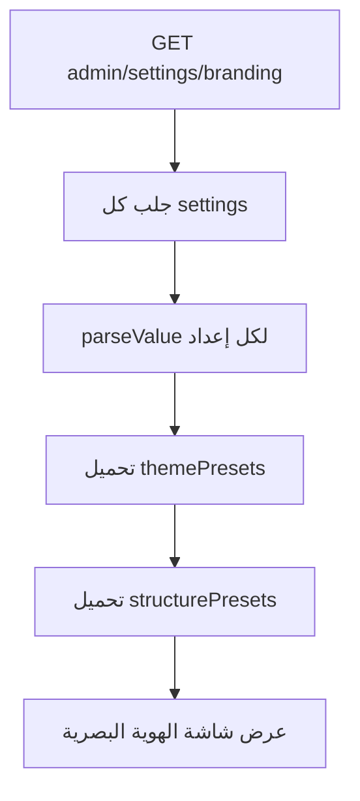
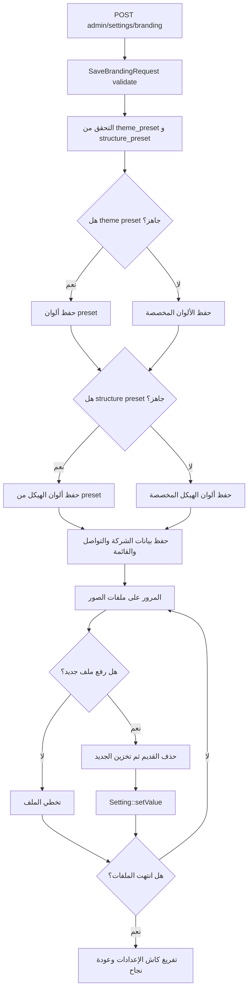

# خوارزمية إدارة الهوية البصرية

## الهدف

تمكين شركة المقاولات من إنشاء هوية رقمية دون تعديل الكود: شعار، ألوان، بيانات تواصل، روابط اجتماعية، نصوص الصفحة الرئيسية، صور الهيرو والفوتر، والقائمة.

## الملفات المرتبطة

- `app/Http/Controllers/Admin/SettingController.php`
- `app/Http/Requests/Admin/SaveBrandingRequest.php`
- `app/Models/Setting.php`
- `app/Providers/AppServiceProvider.php`
- `resources/views/admin/settings/branding.blade.php`

## ما الذي يتم حفظه؟

- ألوان الثيم: `theme_primary_color`, `theme_secondary_color`, `theme_accent_color`.
- ألوان الهيكل: خلفية الموقع، الهيدر، الفوتر، النصوص.
- بيانات الشركة: الاسم، الهاتف، البريد، العنوان.
- روابط التواصل الاجتماعي.
- نصوص الصفحة الرئيسية.
- صور: الشعار، الشعار الشفاف، favicon، صورة الهيرو، صورة من نحن، صورة الفوتر.
- القائمة المخصصة `site_menu`.
- تفعيل اللغات `enable_multilingual`.

## خوارزمية عرض شاشة الهوية



## خوارزمية حفظ الهوية



## مقتطف منطق presets

```php
if ($themePreset !== 'custom' && isset($presets[$themePreset])) {
    $p = $presets[$themePreset];
    Setting::setValue('theme_primary_color', $p['primary'], 'color');
    Setting::setValue('theme_secondary_color', $p['secondary'], 'color');
    Setting::setValue('theme_accent_color', $p['accent'], 'color');
}
```

## نتيجة العملية في الموقع

عند فتح أي صفحة عامة، يعمل `View::composer('site.*')` ويحقن `siteSettings` في القوالب. لذلك تظهر التغييرات في الشعار والألوان والنصوص وروابط التواصل على الموقع.
