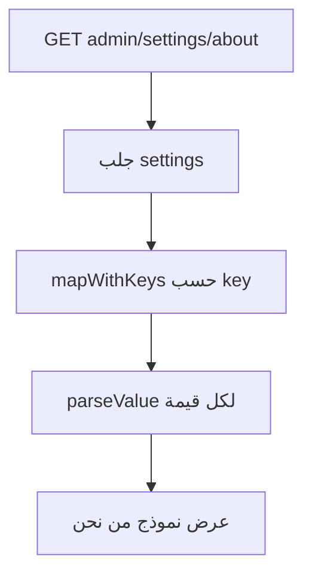
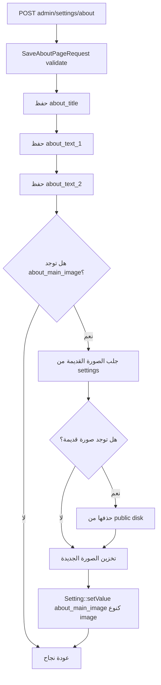
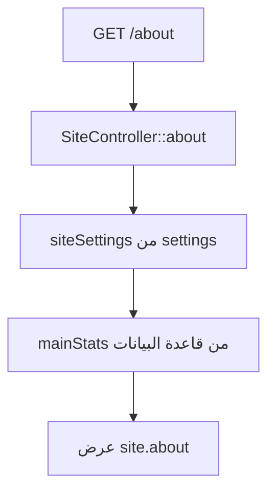

# خوارزمية إدارة صفحة من نحن

## الهدف

إعطاء الشركة صفحة تعريفية قابلة للتعديل من لوحة التحكم، تعرض عنوانا ونصوصا وصورة رئيسية وإحصاءات من بيانات النظام.

## الملفات المرتبطة

- `app/Http/Controllers/Admin/SettingController.php`
- `app/Http/Requests/Admin/SaveAboutPageRequest.php`
- `app/Http/Controllers/SiteController.php`
- `resources/views/site/about.blade.php`

## خوارزمية عرض إعدادات من نحن

## خوارزمية حفظ صفحة من نحن

## خوارزمية عرض الصفحة للزائر

## الإحصاءات المعروضة

تستخدم الصفحة إحصاءات حقيقية من النظام:

- عدد المشاريع.
- عدد الخدمات.
- عدد سنوات الخبرة.
- عدد الوظائف النشطة.

## نتيجة العملية

تتحول صفحة `من نحن` من صفحة ثابتة إلى صفحة تعريفية مرنة تعكس بيانات الشركة وصورتها وإنجازاتها من داخل النظام.
