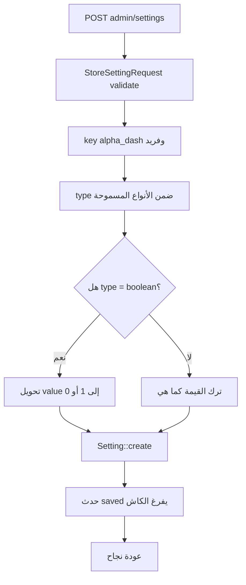
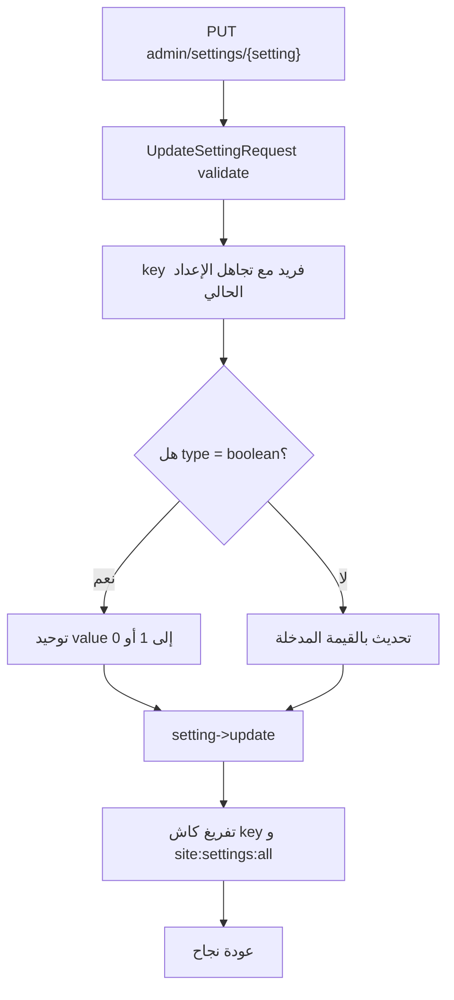
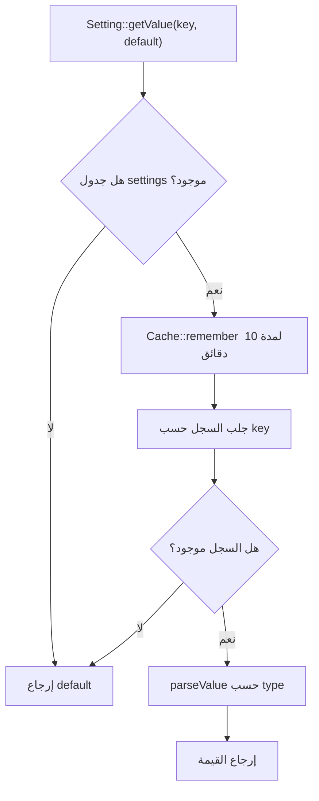

# خوارزمية إدارة الإعدادات العامة

## الهدف

إدارة أي إعداد عام في النظام بمفتاح وقيمة ونوع، مع كاش لتقليل الاستعلامات وتحويل القيم حسب نوعها.

## الملفات المرتبطة

- `app/Http/Controllers/Admin/SettingController.php`
- `app/Http/Requests/Admin/StoreSettingRequest.php`
- `app/Http/Requests/Admin/UpdateSettingRequest.php`
- `app/Models/Setting.php`

## خوارزمية إنشاء إعداد

## خوارزمية تحديث إعداد

## خوارزمية قراءة إعداد

## أنواع القيم

| النوع | طريقة التحويل |
|---|---|
| `text` | يرجع كنص |
| `longtext` | يرجع كنص طويل |
| `json` | يحاول `json_decode` |
| `boolean` | يحول إلى true/false |
| `integer` | يحول إلى رقم |
| `image` | يرجع رابط `/media/{path}` |
| `color` | يرجع كقيمة لون نصية |

## نتيجة العملية

هذه الخوارزمية تجعل إعدادات الموقع مرنة وسريعة، وتربط لوحة التحكم بالقوالب العامة من خلال `siteSettings`.
