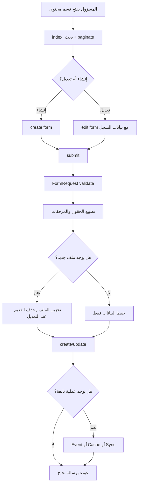

# خوارزمية دورة إدارة المحتوى العامة

## الهدف

شرح النمط المشترك بين أقسام المحتوى: الصفحات، الخدمات، المشاريع، الأخبار، المناقصات، الوظائف، والعملاء.

## النمط العام

كل قسم إداري يمر غالبا بالخطوات التالية:

1. عرض قائمة مع بحث وترقيم صفحات.
2. فتح نموذج إنشاء أو تعديل.
3. التحقق من البيانات.
4. تطبيع الحقول إذا كانت مترجمة.
5. رفع الصور أو الملفات إن وجدت.
6. إنشاء أو تحديث السجل.
7. تنفيذ عمليات تابعة مثل مزامنة الأخبار أو تفريغ الكاش.
8. عرض البيانات المنشورة في الموقع العام.

## Flowchart



## العمليات التابعة حسب القسم

| القسم | العملية التابعة |
|---|---|
| الخدمات | إطلاق `ServiceSavedForNews` لمزامنة خبر تلقائي |
| المشاريع | إطلاق `ProjectSavedForNews` وحذف الصورة القديمة عند التحديث |
| المناقصات | إطلاق `TenderSavedForNews` |
| الوظائف | تحويل المتطلبات والمهارات إلى مصفوفات وإطلاق `JobSavedForNews` |
| الأخبار | ضبط `published_at` تلقائيا إذا كان الخبر منشورا |
| العملاء | منع تعارض المشاريع وربطها بالعميل |
| الإعدادات | تفريغ الكاش |

## تطبيع الحقول المترجمة

إذا كان الإدخال نصا عاديا، يخزن داخل `ar`:

```php
$validated[$field] = ['ar' => $validated[$field]];
```

وإذا كان الإدخال مصفوفة لغات، تزال القيم الفارغة.

## لماذا هذه الدورة مهمة؟

لأنها تجعل لوحة التحكم مصدرا واحدا لإدارة الموقع، وتمنع ظهور محتوى غير منشور أو ناقص للزائر.
