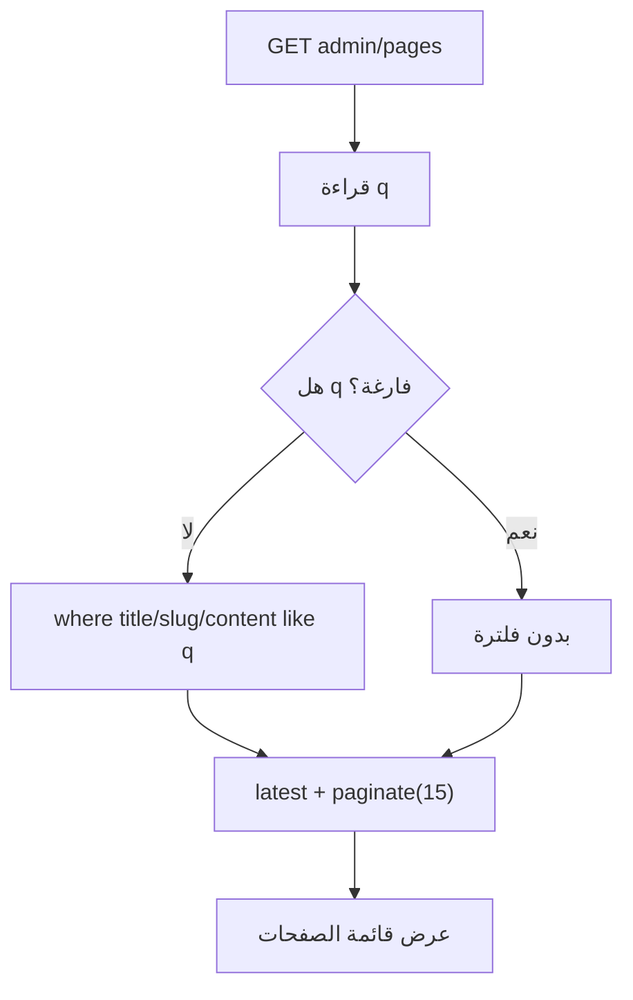
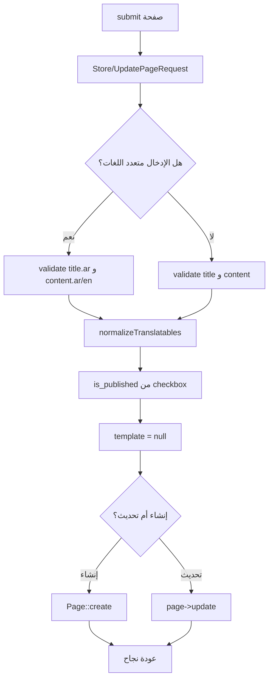
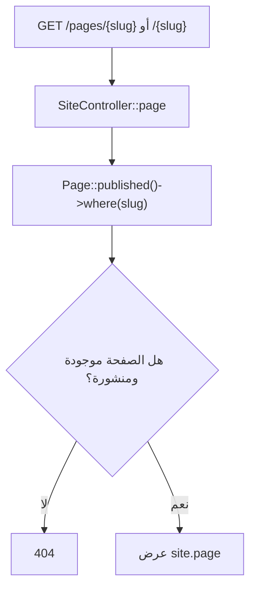

# خوارزمية إدارة الصفحات الثابتة

## الهدف

إنشاء صفحات تعريفية ثابتة من لوحة التحكم، مثل صفحات معلومات أو سياسات أو محتوى تسويقي، ثم عرضها في الموقع عبر رابط `slug`.

## الملفات المرتبطة

- `app/Http/Controllers/Admin/PageController.php`
- `app/Http/Requests/Admin/StorePageRequest.php`
- `app/Http/Requests/Admin/UpdatePageRequest.php`
- `app/Models/Page.php`
- `app/Http/Controllers/SiteController.php`

## خوارزمية القائمة والبحث

## خوارزمية إنشاء أو تحديث صفحة

## خوارزمية العرض في الموقع

## ملاحظات

- `HasUniqueSlug` يولد الرابط من العنوان.
- `published()` يمنع ظهور الصفحة إذا لم تكن منشورة.
- `template` مضبوط حاليا على `null` لأن المشروع يعتمد قالب عرض قياسي للصفحات.
