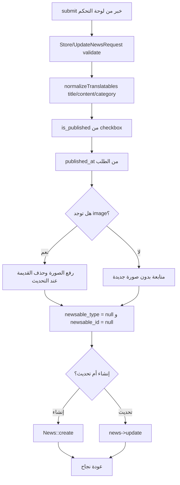
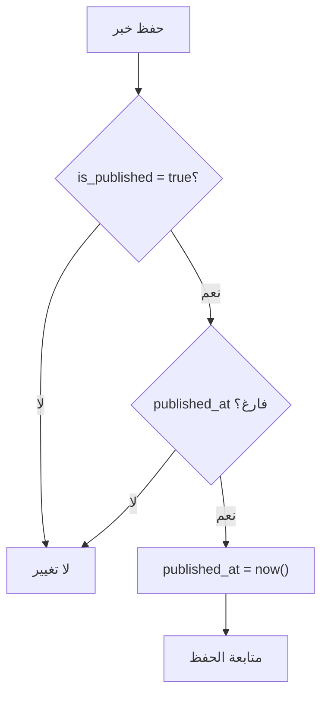
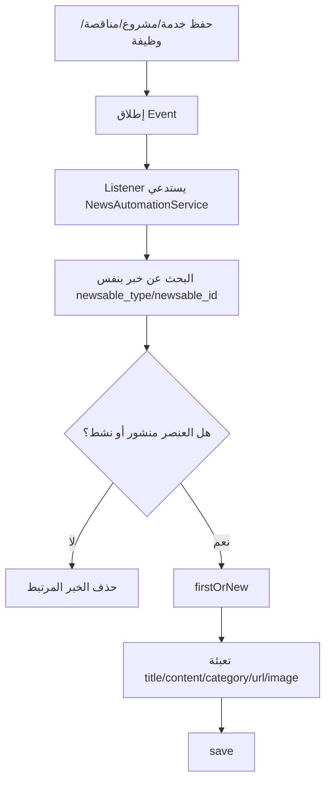
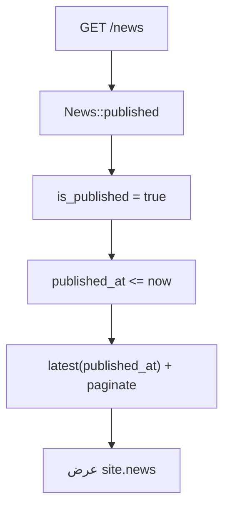

# خوارزمية إدارة الأخبار

## الهدف

إدارة الأخبار اليدوية من لوحة التحكم، مع دعم الأخبار التلقائية التي تنشأ من الخدمات والمشاريع والمناقصات والوظائف.

## الملفات المرتبطة

- `app/Http/Controllers/Admin/NewsController.php`
- `app/Http/Requests/Admin/StoreNewsRequest.php`
- `app/Http/Requests/Admin/UpdateNewsRequest.php`
- `app/Models/News.php`
- `app/Services/NewsAutomationService.php`

## خوارزمية الأخبار اليدوية

## خوارزمية ضبط تاريخ النشر

داخل `News::saving`:

## خوارزمية الأخبار التلقائية

## خوارزمية عرض الأخبار للزوار

## النتيجة

الأخبار اليدوية والتلقائية تتجمع في جدول واحد، وهذا يعطي الشركة صفحة أخبار ومحتوى متجدد دون إدخال مزدوج.
