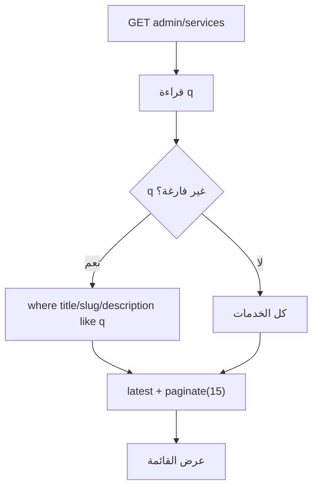
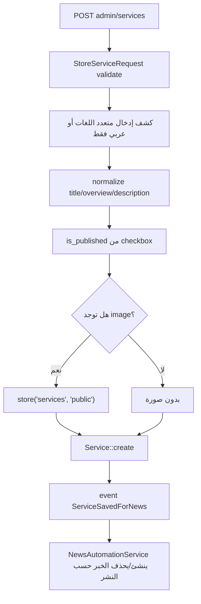
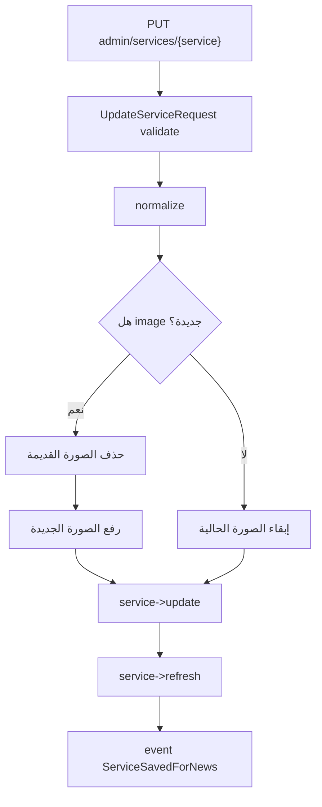
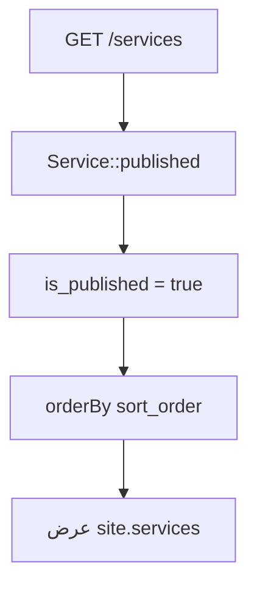

# خوارزمية إدارة الخدمات

## الهدف

إدارة خدمات شركة المقاولات وعرضها في الموقع، مع ربطها بالمشاريع وإنشاء خبر تلقائي عند النشر.

## الملفات المرتبطة

- `app/Http/Controllers/Admin/ServiceController.php`
- `app/Http/Requests/Admin/StoreServiceRequest.php`
- `app/Http/Requests/Admin/UpdateServiceRequest.php`
- `app/Models/Service.php`
- `app/Services/NewsAutomationService.php`

## خوارزمية القائمة والبحث

## خوارزمية إنشاء خدمة

## خوارزمية تحديث خدمة

## خوارزمية العرض في الموقع

## نتيجة العملية

عند نشر خدمة تظهر في صفحة الخدمات، ويمكن أن تظهر لها مشاريع مرتبطة، كما يمكن إنشاء خبر تلقائي عنها في صفحة الأخبار.
