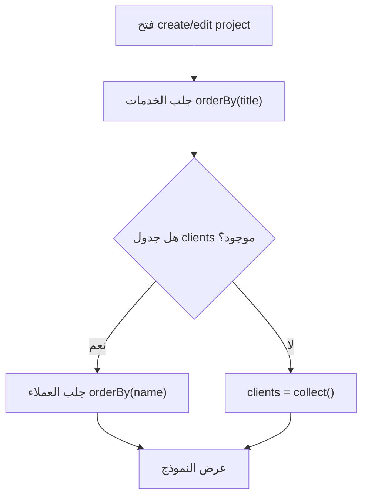
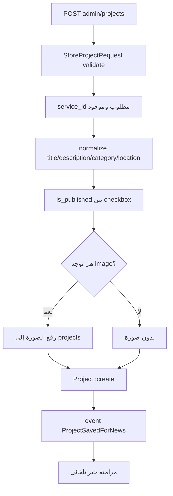
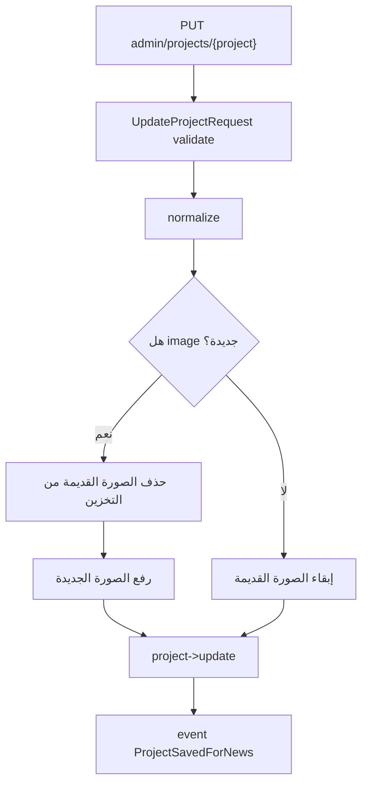
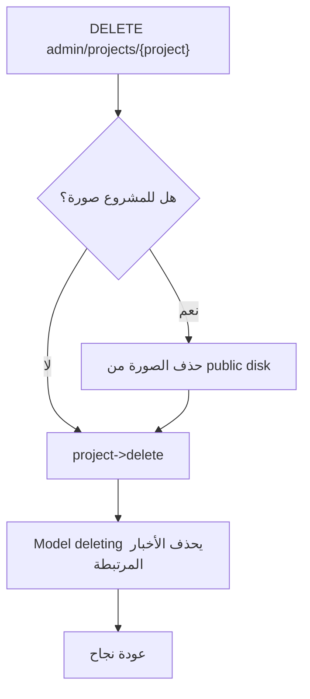
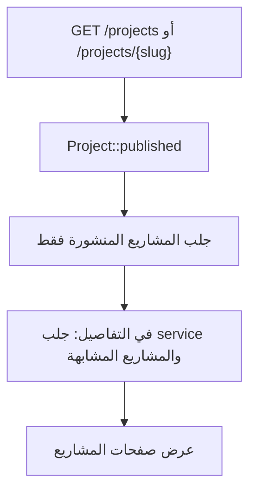

# خوارزمية إدارة المشاريع

## الهدف

إدارة أعمال الشركة المنفذة وربط كل مشروع بخدمة وعميل اختياري، ثم عرضه في الموقع وإنشاء خبر تلقائي عند نشره.

## الملفات المرتبطة

- `app/Http/Controllers/Admin/ProjectController.php`
- `app/Http/Requests/Admin/StoreProjectRequest.php`
- `app/Http/Requests/Admin/UpdateProjectRequest.php`
- `app/Models/Project.php`
- `app/Models/Service.php`
- `app/Models/Client.php`
- `app/Services/NewsAutomationService.php`

## خوارزمية تجهيز نموذج الإنشاء أو التعديل

## خوارزمية إنشاء مشروع

## خوارزمية تحديث مشروع

## خوارزمية حذف مشروع

## خوارزمية العرض في الموقع

## نتيجة العملية

المشروع المنشور يصبح جزءا من معرض أعمال الشركة، ويرتبط بالخدمة والعميل، وقد ينتج عنه خبر تلقائي في الأخبار.
