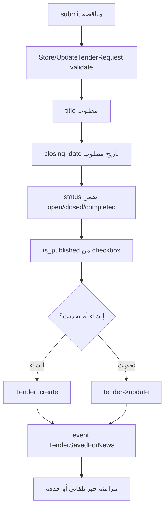
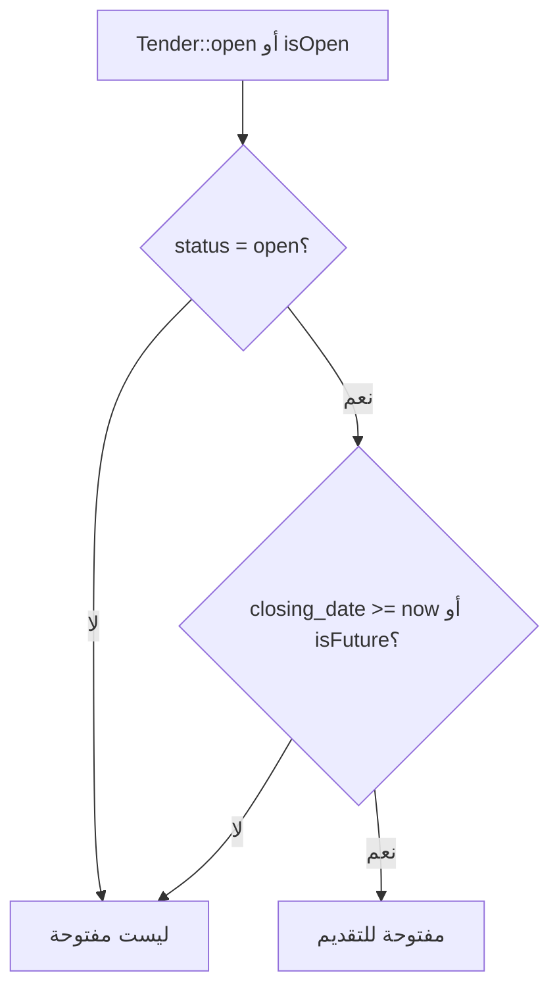
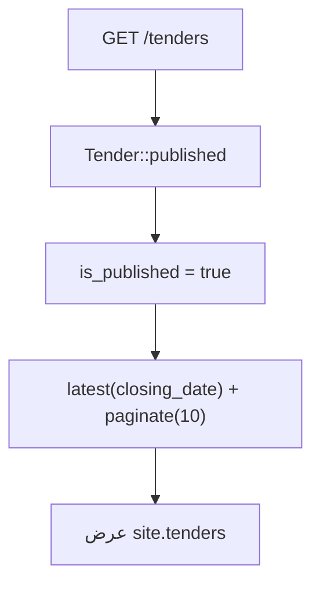
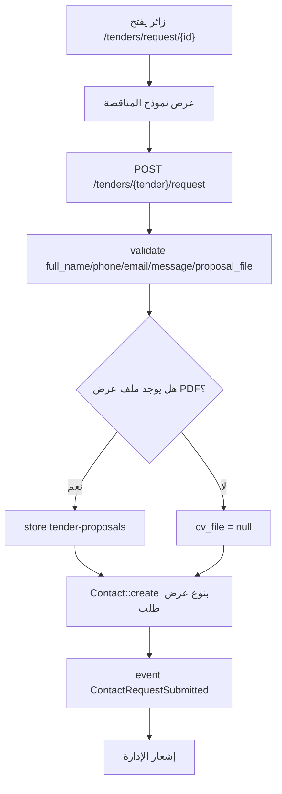

# خوارزمية إدارة المناقصات

## الهدف

إدارة المناقصات التي تعلنها الشركة، مع حالة النشر وتاريخ الإغلاق، ثم عرضها في الموقع واستقبال عروض الزوار عليها.

## الملفات المرتبطة

- `app/Http/Controllers/Admin/TenderController.php`
- `app/Http/Requests/Admin/StoreTenderRequest.php`
- `app/Http/Requests/Admin/UpdateTenderRequest.php`
- `app/Models/Tender.php`
- `app/Services/NewsAutomationService.php`
- `app/Http/Controllers/ContactRequestController.php`

## خوارزمية إنشاء أو تحديث مناقصة

## خوارزمية تحديد المناقصة المفتوحة

## خوارزمية عرض المناقصات للزائر

## خوارزمية إرسال عرض مناقصة

## نتيجة العملية

تستطيع الشركة نشر المناقصات واستقبال عروض PDF من المقاولين أو الموردين، وتصل كل العروض إلى صندوق الطلبات في لوحة التحكم.
