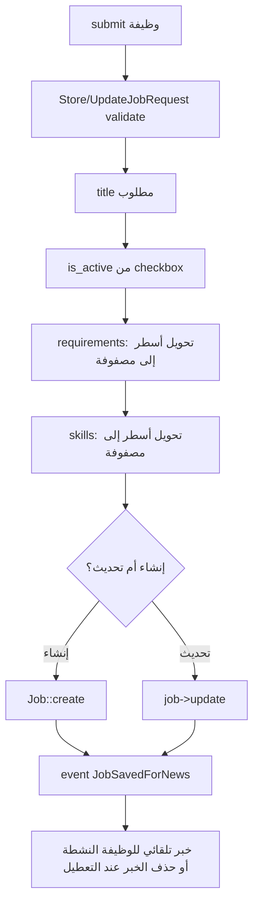
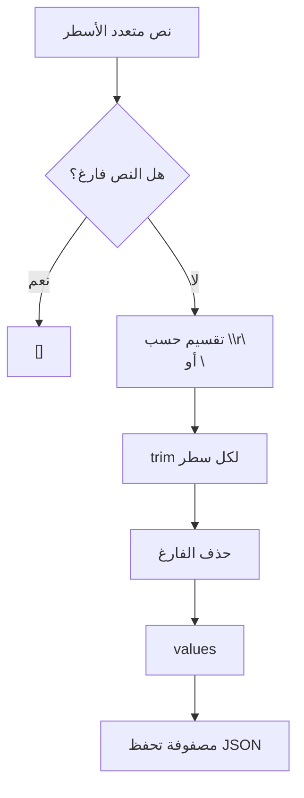
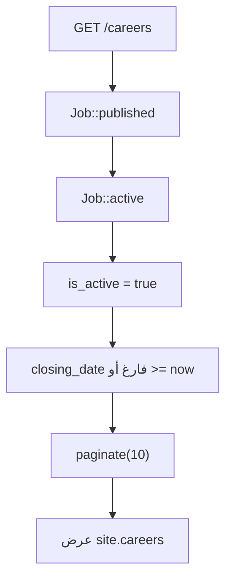
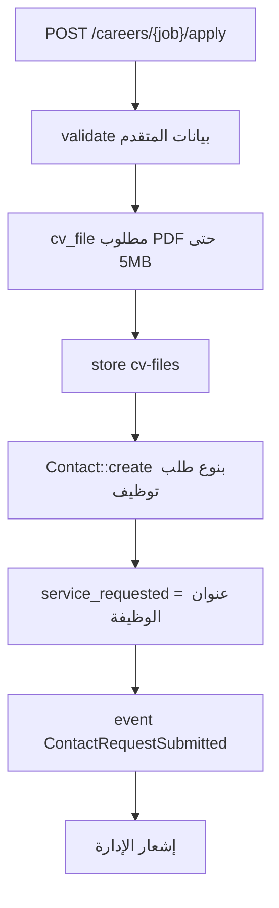

# خوارزمية إدارة الوظائف

## الهدف

إدارة الوظائف الشاغرة في الشركة، عرض النشطة منها فقط في الموقع، واستقبال طلبات التقديم مع ملفات السيرة الذاتية.

## الملفات المرتبطة

- `app/Http/Controllers/Admin/JobController.php`
- `app/Http/Requests/Admin/StoreJobRequest.php`
- `app/Http/Requests/Admin/UpdateJobRequest.php`
- `app/Models/Job.php`
- `app/Http/Controllers/ContactRequestController.php`
- `app/Services/NewsAutomationService.php`

## خوارزمية إنشاء أو تحديث وظيفة

## خوارزمية تحويل المتطلبات والمهارات

## خوارزمية عرض الوظائف

## خوارزمية التقديم على وظيفة

## نتيجة العملية

تدير الشركة صفحة توظيف كاملة، وتصل طلبات المرشحين إلى لوحة التحكم ضمن الرسائل والطلبات.
