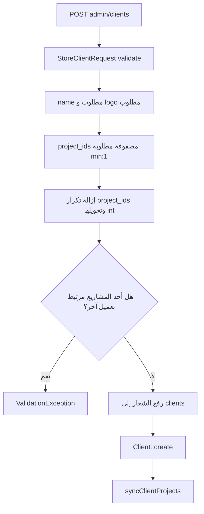
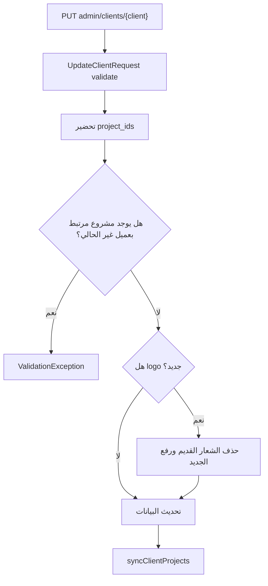
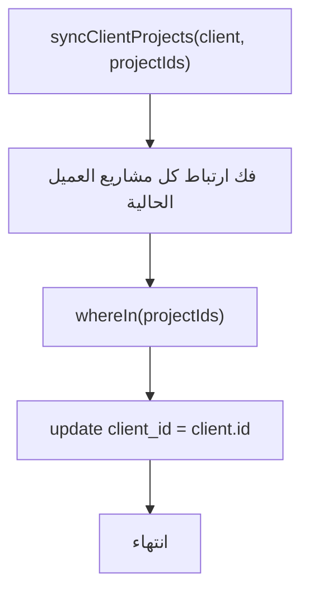
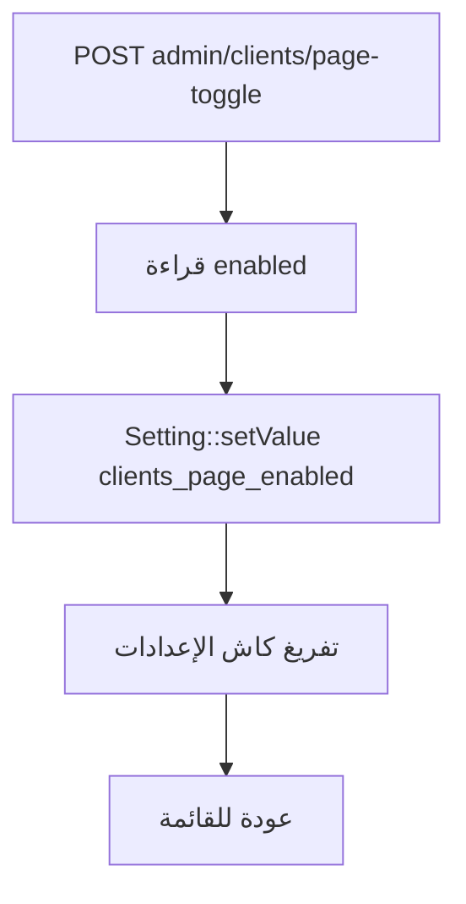
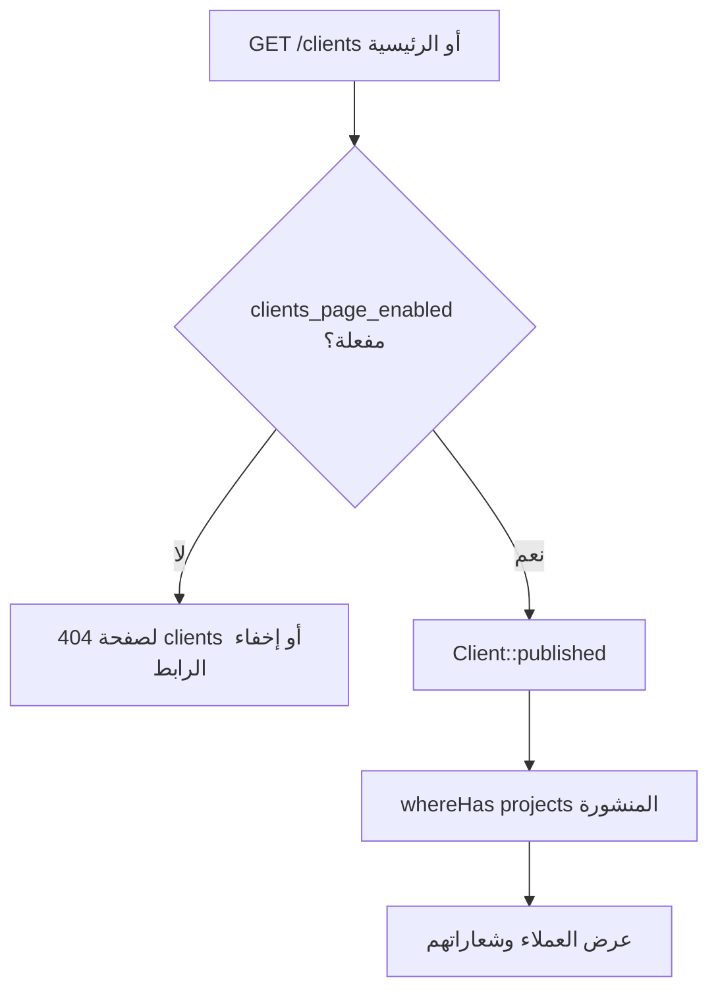

# خوارزمية إدارة العملاء

## الهدف

إدارة شعارات وعملاء الشركة وربطهم بمشاريع حقيقية، ثم عرضهم في الصفحة الرئيسية وصفحة عملاؤنا عند تفعيلها.

## الملفات المرتبطة

- `app/Http/Controllers/Admin/ClientController.php`
- `app/Http/Requests/Admin/StoreClientRequest.php`
- `app/Http/Requests/Admin/UpdateClientRequest.php`
- `app/Models/Client.php`
- `app/Models/Project.php`
- `app/Models/Setting.php`

## خوارزمية إنشاء عميل

## خوارزمية تحديث عميل

## خوارزمية مزامنة مشاريع العميل

## خوارزمية تفعيل صفحة العملاء

## خوارزمية العرض في الموقع

## نتيجة العملية

لا يظهر العميل كاسم مجرد، بل يرتبط بمشاريع فعلية، وهذا يجعل صفحة العملاء أقوى تسويقيا وأكثر مصداقية.
