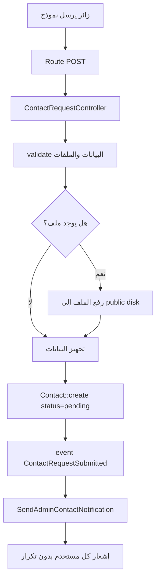
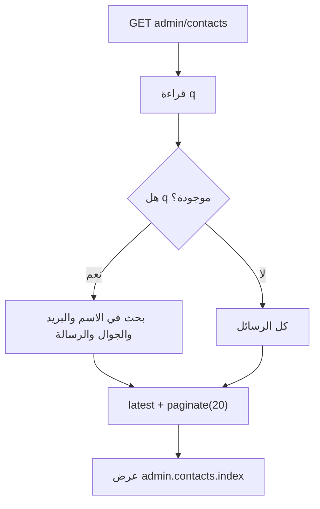
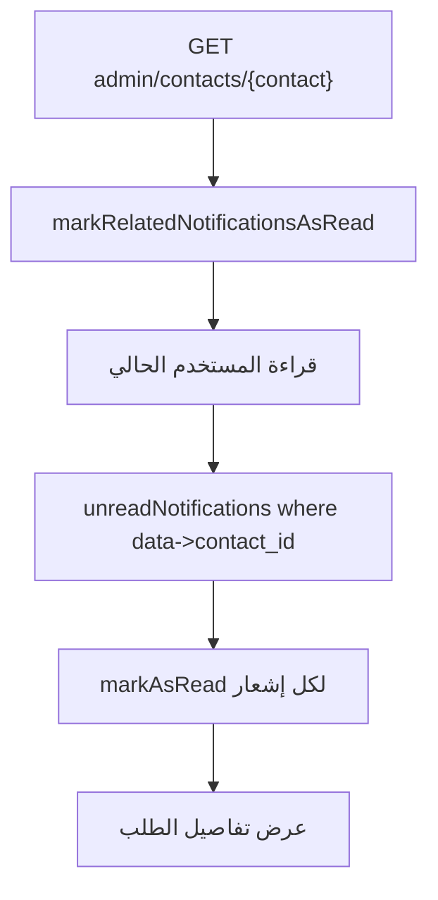
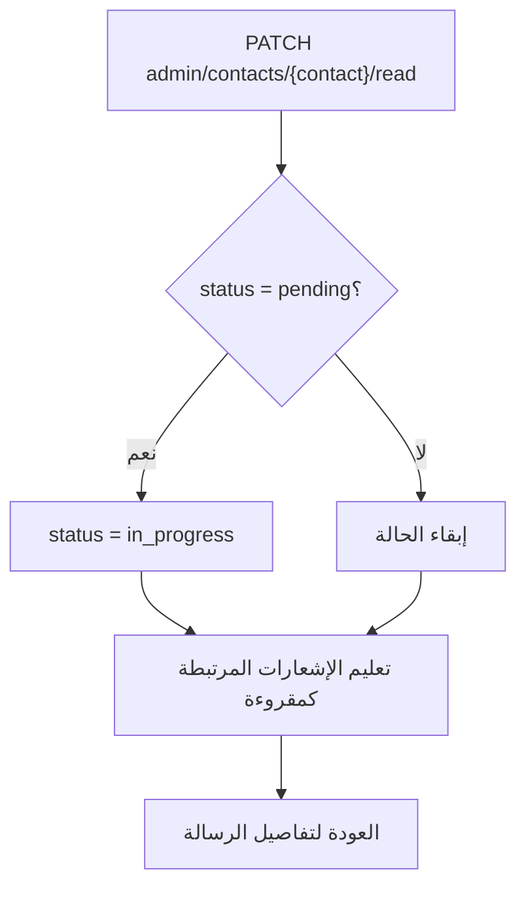
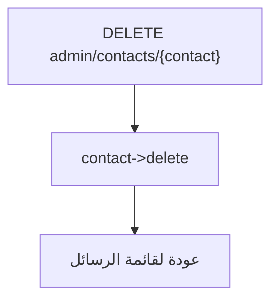

# خوارزمية إدارة الرسائل والطلبات

## الهدف

استقبال كل تفاعلات الزوار في جدول واحد `contacts` ثم عرضها في لوحة التحكم ومتابعة حالتها.

## الملفات المرتبطة

- `app/Http/Controllers/ContactRequestController.php`
- `app/Http/Controllers/Admin/ContactController.php`
- `app/Listeners/SendAdminContactNotification.php`
- `app/Notifications/NewContactRequestNotification.php`
- `app/Models/Contact.php`

## مصادر الطلبات

| المصدر | النوع المخزن |
|---|---|
| نموذج التواصل العام | `تواصل عام` |
| طلب خدمة | `طلب خدمة` |
| تقديم وظيفة | `طلب توظيف` |
| عرض مناقصة | `عرض طلب` |

## خوارزمية استقبال طلب من الزائر

## خوارزمية عرض الرسائل في الإدارة

## خوارزمية فتح رسالة

## خوارزمية تحويل الحالة إلى قيد المعالجة

## خوارزمية حذف رسالة

## نتيجة العملية

كل فرصة تواصل أو طلب خدمة أو توظيف أو عرض مناقصة تتحول إلى سجل قابل للمتابعة، مما يجعل الموقع أداة تشغيل وليس مجرد واجهة تعريفية.
