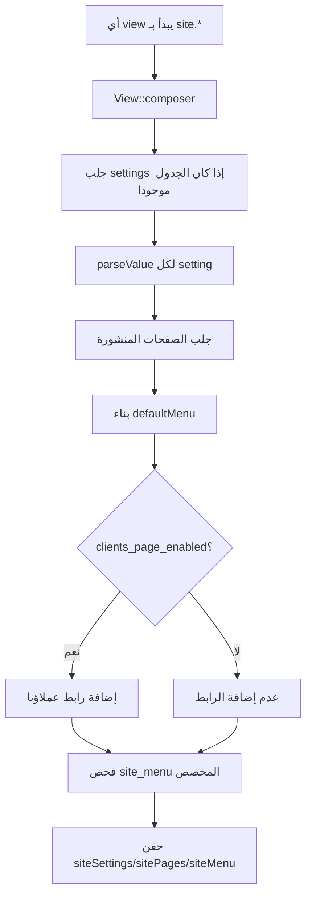
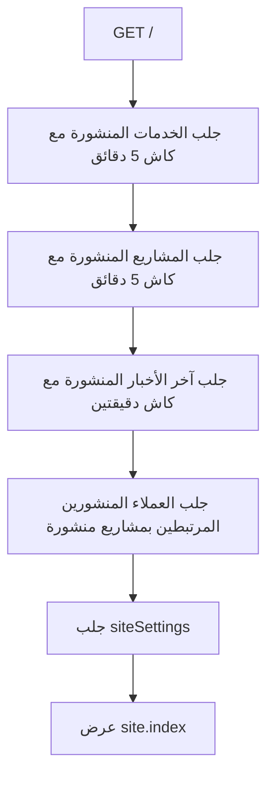
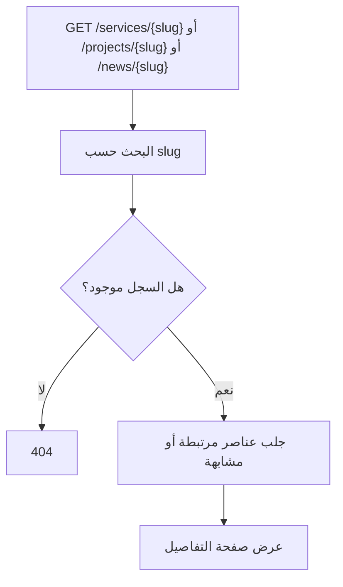
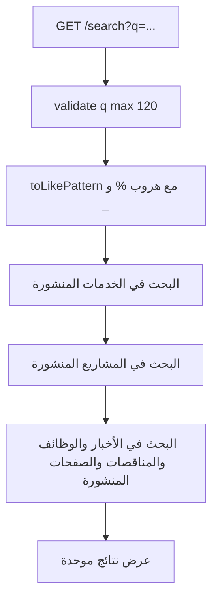
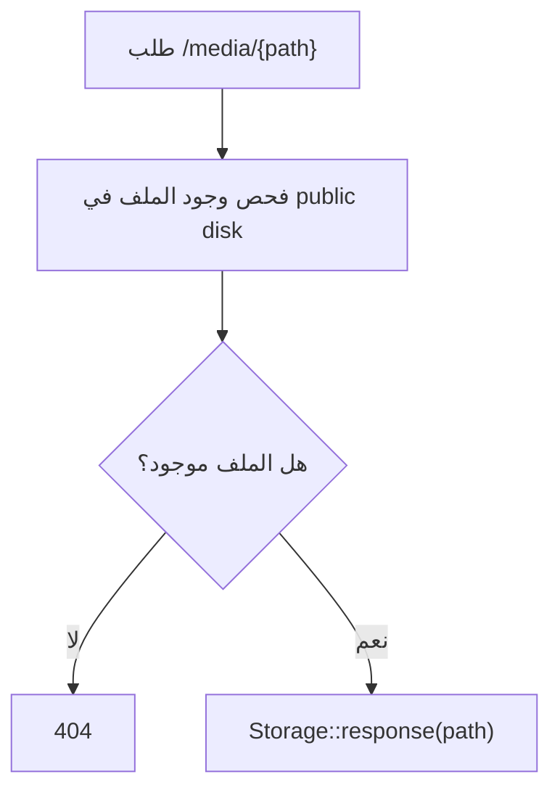

# خوارزمية عرض الموقع العام

## الهدف

شرح كيف يتحول محتوى لوحة التحكم إلى صفحات عامة يراها الزائر، مع إخفاء غير المنشور وجلب الإعدادات والقائمة تلقائيا.

## الملفات المرتبطة

- `app/Http/Controllers/SiteController.php`
- `app/Providers/AppServiceProvider.php`
- `app/Models/Setting.php`
- `routes/web.php`
- `resources/views/site/*`

## خوارزمية حقن الإعدادات والقائمة في كل صفحة

## خوارزمية الصفحة الرئيسية

## خوارزمية صفحات التفاصيل

## خوارزمية البحث العام

## خوارزمية الوسائط

## نتيجة العملية

الموقع العام لا يقرأ كل شيء عشوائيا؛ بل يعتمد على قواعد نشر وكاش وإعدادات مركزية، لذلك يرى الزائر نسخة مرتبة ومفلترة من المحتوى الذي تديره الشركة.
