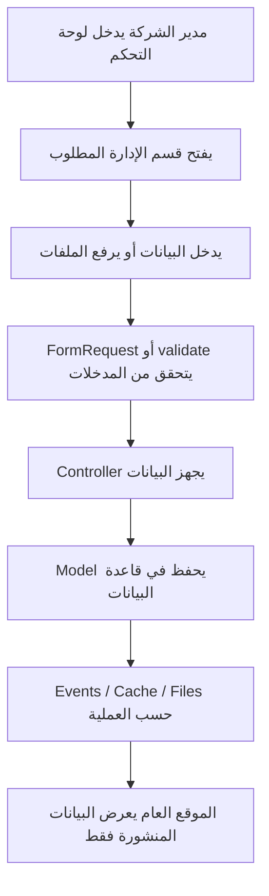

# خوارزميات عمليات التطبيق

## هدف المشروع

هذا المشروع يبني تطبيق ويب كامل لشركات المقاولات التي لا تملك وجودا رقميا واضحا. التطبيق يوفر:

- موقعا عاما يعرض هوية الشركة وخدماتها ومشاريعها وأخبارها ومناقصاتها ووظائفها وعملاءها.
- لوحة تحكم لإدارة الهوية الرقمية والمحتوى والطلبات دون الحاجة إلى تعديل الكود.
- دورة نشر كاملة: إدخال من الإدارة، تخزين منظم، ثم ظهور المحتوى المنشور في الموقع.

هذا المجلد يشرح خوارزميات العمليات التي تجري داخل التطبيق من زاوية تشغيلية: ماذا يحدث عندما يسجل المسؤول الدخول؟ كيف تنشأ صفحة؟ كيف تنشر خدمة؟ كيف يصل طلب زائر إلى لوحة التحكم؟

## الفهرس

| الملف | العملية |
|---|---|
| [00_project_operation_map.md](00_project_operation_map.md) | خريطة تشغيل التطبيق من لوحة التحكم إلى الموقع |
| [01_admin_login.md](01_admin_login.md) | تسجيل الدخول والإعداد الأولي للوحة التحكم |
| [02_user_management.md](02_user_management.md) | إدارة مستخدمي لوحة التحكم والصلاحيات |
| [03_visual_identity_management.md](03_visual_identity_management.md) | إدارة الهوية البصرية وبيانات الشركة |
| [04_about_page_management.md](04_about_page_management.md) | إدارة صفحة من نحن |
| [05_general_settings_management.md](05_general_settings_management.md) | إدارة الإعدادات العامة والكاش |
| [06_content_management_cycle.md](06_content_management_cycle.md) | دورة إدارة المحتوى العامة |
| [07_static_pages_management.md](07_static_pages_management.md) | إدارة الصفحات الثابتة |
| [08_news_management.md](08_news_management.md) | إدارة الأخبار اليدوية والتلقائية |
| [09_services_management.md](09_services_management.md) | إدارة الخدمات |
| [10_projects_management.md](10_projects_management.md) | إدارة المشاريع |
| [11_tenders_management.md](11_tenders_management.md) | إدارة المناقصات |
| [12_jobs_management.md](12_jobs_management.md) | إدارة الوظائف |
| [13_clients_management.md](13_clients_management.md) | إدارة العملاء وربطهم بالمشاريع |
| [14_messages_requests_management.md](14_messages_requests_management.md) | إدارة الرسائل والطلبات الواردة |
| [15_public_site_rendering.md](15_public_site_rendering.md) | خوارزمية عرض الموقع العام من بيانات لوحة التحكم |

## مبدأ مشترك

أغلب العمليات تتبع المسار التالي:

## الملفات البرمجية الأكثر ارتباطا

- `routes/web.php`
- `app/Http/Controllers/Admin/*`
- `app/Http/Controllers/SiteController.php`
- `app/Http/Controllers/ContactRequestController.php`
- `app/Models/*`
- `app/Services/NewsAutomationService.php`
- `app/Providers/AppServiceProvider.php`
